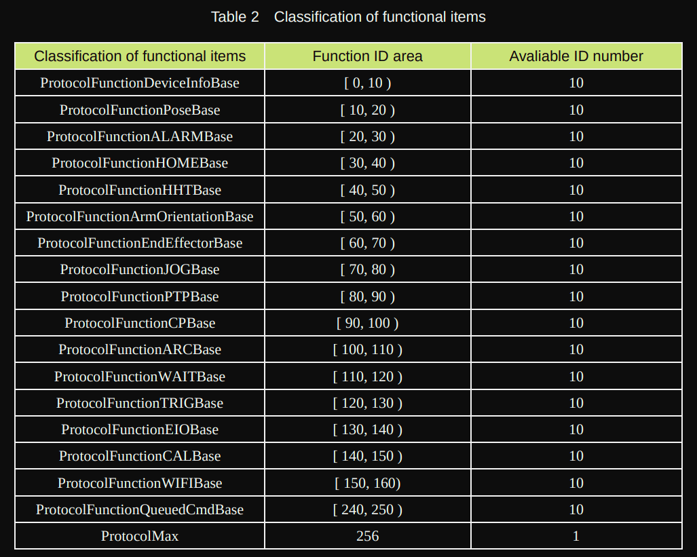

# Dobot Communication Protocol v.1.1.5 in a nutshell

This project use Dobot Comuunication Protocol v.1.1.5 to control Dobot. see in [Dobot Communication Protocol v.1.1.5](files/Dobot-Communication-Protocol-V1.1.5.pdf)

## Connection and Initialization

The default parameters of the Dobot for each communication protocol are:

### USB

-   Baudrate: `115200bps`
-   Data bits: `8`
-   Stop bit: `1`
-   Parity: `None` ( Void )

### Wi-Fi

-   IP: `"Route and other distribution"` ( Auto )
-   Port: `8899`

### Bluetooth

-   Service UUID: `0003CDD0-0000-1000-8000-00805F9B0131`
-   Read (Command) port characteristic UUID: `0003CDD1-0000-1000-8000-00805F9B0131`

### TTL

-   Baudrate: `115200bps`
-   Data bits: `8`
-   Stop bit: `1`
-   Parity: `None` ( Void )

## Protocol instructions

Resume: Using the Dobot with any type of communication you need to understand the "pipeline" of protocol. The physiscal layer receives 8 bits raw data each time ( need determine the start, end and verify the accuracy of the data by communication protocols ). The communication protocol includes packet header, packet load and checksum to ensure the accurate transmission.

_🍀 Tip:_

-   _Protocol command does not have fixed length._
-   _Protocol command consists of packet header, payload frame, and check._

## Shotcuts

#### Functions command area

_🗒️ Notes:_

-   _In the following Ctrl byte, the bit 0 of Ctrl is rw, the bit 1 of Ctrl is Queued_
-   _When isQueue = 1,that indicats the instruction is a queue command,which returns a 64-bit index. So the length is 2+8. When isQueue = 0, the instruction is an immediate command,which has no return. So the length is 2+0._
-   _In the following Ctrl byte, the bit 0 of Ctrl is rw, the bit 1 of Ctrl is Queued_

#### Command and descriptions

All commands need to pass on package:

1. The `header` of the packet
2. `Length` of the packet
3. The `command ID`
4. `Control` data: rw and queued
5. Payload `params`
6. `Checksum` of the packet

Can be found in [Dobot Communication Protocol v.1.1.5](files/Dobot-Communication-Protocol-V1.1.5.pdf) from section 1.3 to 1.19.7
