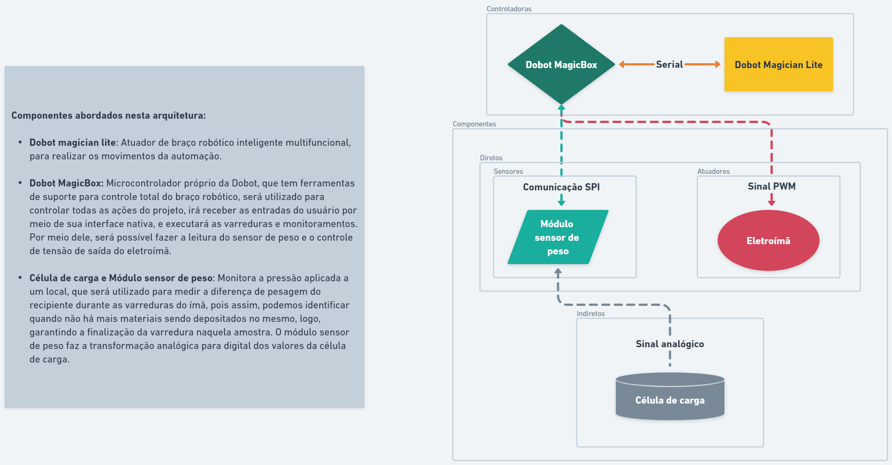

<table>
<tr>
<td>

</td>
<td>
</td>
</tr>
</table>

Concepção de sistema de automação industrial

>*Observação 1: A estrutura inicial deste documento é só um exemplo. O seu grupo deverá alterar esta estrutura de acordo com o que está sendo solicitado nos artefatos.*

>*Observação 2: O índice abaixo não precisa ser editado se você utilizar o Visual Studio Code com a extensão **Markdown All in One**. Essa extensão atualiza o índice automaticamente quando o arquivo é salvo.*

**Conteúdo**

- [Autores](#autores)
- [Visão Geral do Projeto](#visão-geral-do-projeto)
  - [Empresa](#empresa)
  - [O Problema](#o-problema)
  - [Objetivos](#objetivos)
    - [Objetivos gerais](#objetivos-gerais)
    - [Objetivos específicos](#objetivos-específicos)
  - [Partes interessadas](#partes-interessadas)
- [Análise do Problema](#análise-do-problema)
  - [Análise da área de atuação](#análise-da-área-de-atuação)
  - [Análise do cenário: Matriz SWOT](#análise-do-cenário-matriz-swot)
  - [Proposta de Valor: Value Proposition Canvas](#proposta-de-valor-value-proposition-canvas)
  - [Matriz de Risco](#matriz-de-risco)
- [Requisitos do Sistema](#requisitos-do-sistema)
  - [Personas](#personas)
  - [Histórias dos usuários (user stories)](#histórias-dos-usuários-user-stories)
- [Arquitetura do Sistema](#arquitetura-do-sistema)
  - [Módulos do Sistema e Visão Geral (Big Picture)](#módulos-do-sistema-e-visão-geral-big-picture)
  - [Descrição dos Subsistemas](#descrição-dos-subsistemas)
    - [Requisitos de software](#requisitos-de-software)
  - [Tecnologias Utilizadas](#tecnologias-utilizadas)
- [UX e UI Design](#ux-e-ui-design)
  - [Wireframe + Storyboard](#wireframe--storyboard)
  - [Design de Interface - Guia de Estilos](#design-de-interface---guia-de-estilos)
- [Projeto de Banco de Dados](#projeto-de-banco-de-dados)
  - [Modelo Conceitual](#modelo-conceitual)
  - [Modelo Lógico](#modelo-lógico)
- [Teste de Software](#teste-de-software)
  - [Testes Unitários](#testes-unitários)
  - [Teste de Usabilidade](#teste-de-usabilidade)
- [Análise de Dados](#análise-de-dados)
- [Manuais](#manuais)
  - [Manual de Implantação](#manual-de-implantação)
  - [Manual do Usuário](#manual-do-usuário)
  - [Manual do Administrador](#manual-do-administrador)
- [Referências](#referências)

# Autores

- Jean Lucas Rothstein Machado
- Antonio Angelo Teixeira
- Rafael Nissim Katalan
- Vinicios Venâncio Lugli
- Felipe Henrique Moreira Leão
- Pablo Ruan Lana Viana
- Gustavo Ferreira de Oliveira

# Visão Geral do Projeto

## Empresa

*Descrição_da_empresa*

## O Problema

No início do módulo, foi nos apresentado, durante o processo de exposição do projeto para a turma de Engenharia da Computação do Inteli, o Instituto de Pesquisa Tecnológicas - IPT . Tal projeto traz como principal foco o processo de separação de minérios (imagem 1), ao qual ainda é realizado manualmente por um operador (técnico de laboratório do IPT) que leva em média de 20 – 30 minutos dependendo do tamanho de amostra e concentração de minérios de ferro encontrados na amostra.

## Objetivos

### Objetivos gerais

Com o intuito de aliviar os problemas e as dores apresentadas, produziremos uma solução que emprega um braço mecânico para a automação da tarefa de separação de materiais magnéticos. O técnico precisará apenas inserir a amostra nas bandejas, configurar o campo magnético desejado e supervisionar o procedimento, que será executado automaticamente.

### Objetivos específicos

Para cumprir com o objetivo citado, o robô fará a tarefa de executar a varredura da bandeja inicial da amostra com um eletroímã, que deverá ser ajustado de acordo com o metal que deseja-se obter. Após essa configuração, o robô começará a varrer a amostra, mantendo uma distância e o campo magnético fixos. Em seguida à finalização da varredura, o robô irá submergir em água o que foi coletado, com o intuito de retirar as impurezas que ficaram retidas. Posteriormente, o braço irá se direcionar para a bandeja de coleta, onde o ímã será desativado e a amostra será depositada. O processo será repetido até que toda a amostra seja coletada.

## Partes interessadas

- IPT - Instituto de Pesquisas Tecnológicas.
- INTELI - Instituto de Tecnologia e Liderança.

# Análise do Problema

#### 
1 — Demonstração do processo manual de separação de amostras realizado pelo IPT.

  
O processo de separação de amostras atualmente ocorre da seguinte forma: sobre uma mesa são dispostos 3 ímãs de diferentes potenciais (medidos em Gauss); 3 bandejas; 1 saco plástico; 1 recipiente com a amostra (imagem 2). Em todas as 3 bandejas são colocados água para facilitar a manipulação da amostra - na primeira bandeja é despejado a amostra e as outras 2 bandejas irão ser utilizadas como apoio durante o processo de separação manual. Após estas etapas, é escolhido o ímã que mais atrai minérios magnéticos, o qual é envolvido em um plástico (para facilitar a retirada dos materiais de ferros recolhidos pelo ímã).

Após esta fase, o ímã é mergulhado e passa pela bandeja que se encontra com água e a amostra, posteriormente na segunda bandeja só com água e por último solto e armazenado na última bandeja. Este processo é feito várias vezes com o ímã de maior potência e depois  com os outros dois ímãs de menor potência, sendo realizado as etapas da mesma forma.

#### 
2 - Processo manual de separação de amostras realizado pelo IPT.

A necessidade de atualizar este processo vem das grandes demandas de empresas procurando o IPT para realizar testes de separação de minérios em amostra de perfurações realizadas em alguns terrenos. Essas amostras, por sua vez, têm a intenção de analisar a viabilidade do investimento em mineração desses terrenos por meio de algumas métricas pré-estabelecidas, que procuram informações acerca de presença, quantidade e qualidade dos minérios de ferro para extração ponderando viabilidade financeira e ambiental. Algumas das informações almejadas para tal análise são:

1. Concentração de ferro na amostra;
2. Qualidade do minério para determinar a pureza desse;
3. Características geológicas do minério;
4. Quantidade de recursos disponíveis para mineração no local;
5. Riscos ambientais envolvidos com o projeto.

Com a separação magnética feita de forma automática com o braço mecânico, a medição dos minérios poderá ser mais efetiva, e assim, será possível analisar mais facilmente esses parâmetros para viabilização do projeto de mineração do ambiente pretendido.

## Dados levantados e analisados relativos ao problema

Após uma análise da realização da separação pelo técnico de laboratório, é possível perceber que a cada passagem, é gasto aproximadamente 1 minuto. A partir disso, poderemos quantificar se a automação estará trazendo economia de tempo e aumento da produtividade.

Atualmente, o ímã que apresenta o melhor resultado para a separação metálica é de 3000 Gauss, conforme os testes que já foram realizados. No laboratório, há também ímãs de 1500 e 6000 Gauss, que podem ser utilizados de acordo com a amostra que estiver sendo testada.

Existem diferentes tipos de separadores magnéticos, sendo normalmente usados ímãs permanentes, que incluem: ímãs de barra, disco, pulso, rolo, tambor e correia, e dentre esses, os ímãs de barra são utilizados atualmente na separação. Para otimização do processo, esses materiais serão substituídos por eletroímãs que variam o campo magnético para melhor separação dos minérios.
Em relação à taxa de eficiência da separação magnética em minérios, no entanto, pode haver uma variação dependendo de diversos fatores, incluindo a composição mineral do minério, a granulometria, a concentração de minério, a intensidade do campo magnético e o tipo de separador magnético utilizado.

Os metais que despertam o maior interesse da indústria atualmente são o ferro e o cobre. Entretanto, esses metais apresentam uma grande diferença de atração magnética, o que permite que a separação magnética seja bastante efetiva. Como o ferro apresenta um potencial de atração muito alto, um campo magnético muito baixo é o suficiente para atrair as amostras desse tipo de minério. Após a separação desse minério, poderá ser utilizado um campo magnético de intensidade maior, para que o cobre seja atraído com maior facilidade.

## Análise da área de atuação

*Descrição_da_análise_da_área_de_atuação*

## Análise financeira do projeto

O cenário financeiro do parceiro, laboratório de mineração do IPT, atualmente é de 8 análises de solo por mês com cada uma custando na faixa de 3 mil reais. Ainda nesse sentido, podemos considerar o técnico que realiza o processo manual como único custo que deve ser considerado, pois esse será o único custo que, efetivamente, mudará, porque com a automação, o técnico ficará livre para realizar outros trabalhos gerando um valor apenas dependente de suas qualificações. 
Por outro lado, com o processo de automatização realizado, o rendimento aumentaria em 25%, passando para 10 amostras analisadas por mês, mantendo-se em 3 mil reais. Dessa maneira, para realizar esse processo, o robô custaria 20 mil reais somado a um kit de 600 reais, que seriam custos únicos, além dos custos por mês de operação, sendo dividido em estruturação e implementação. Os custos de estruturação são de operação com 2,5 mil reais, 4 mil por ano de manutenção e um engenheiro robótico com salário de 20 mil reais. Já no processo de implementação, os custos são: 2,5 mil reais e uma equipe com o engenheiro e três funcionários, totalizando pouco mais de 42 mil reais. 
Em última análise, realizando-se os cálculos, chega-se à conclusão que o valor da automação deve custar algo próximo a 90 mil reais, com dois meses de operação. Assim, esse processo se pagaria em torno de 10 meses, pois o aumento de desempenho irá gerar nove mil reais a mais por mês, somando com o que o técnico, que terá mais tempo livre, conseguirá realizar com esse tempo de sobra.

## Análise das 5 forças de Porter

## Proposta de Valor: Value Proposition Canvas

## Matriz de Risco

## Matriz de avaliação de valor Oceano Azul

 

# Requisitos do Sistema

1. Um braço robótico capaz de posicionar um manipulador em posição e distância
controladas sobre a bandeja de amostras;
2. Eletroímã montado no manipulador do braço robótico com campo magnético ajustável
na faixa de 800 a 12.000 Gauss;
3. Estrutura para calibração de posicionamento do braço;
4. Estrutura para calibração de eletroímã;
5. Automação da bandeja de amostra para promover a agitação das partículas;
6. Recipiente com automatização de pesagem para receber material coletado (opcional);
7. Relatório apresentando todos os dados pertinentes do ensaio (opcional).

## Personas

## Histórias dos usuários (user stories)

### Técnico do laboratório IPT

1. Eu, como técnico de laboratório do IPT, desejo poder variar o campo magnético sem mover a distância do ímã para coletar minérios mais ou menos atrativos.
2. Eu, como técnico de laboratório do IPT, desejo que a bandeja vibre e misture a amostra para melhor qualidade do experimento.
3. Eu, como técnico de laboratório do IPT, desejo que a estrutura de bandejas seja removível para maior facilidade de lavagem e remoção de amostras.
4. Eu, como técnico de laboratório do IPT, desejo automatizar o processo de varredura e separação de amostras.
5. Eu, como técnico de laboratório do IPT, desejo dedicar mais meu tempo para pesagem e análise química das amostras.
6. Eu, como técnico de laboratório do IPT, desejo uma interface para uso do robô que seja de fácil utilização e simples manutenção.

### Engenheiro responsável pelo laboratório

1. Eu, como engenheiro responsável pelo laboratório  do IPT, desejo que a amostra analisada seja de maior confiabilidade do que possui hoje em dia.
2. Eu, como engenheiro responsável pelo laboratório  do IPT, desejo que a amostra seja analisada de maneira mais rápida para maior satisfação dos clientes.
3. Eu, como engenheiro responsável pelo laboratório  do IPT, desejo que a aplicação seja de fácil manutenção para não parar por muito tempo o atendimento dos clientes do laboratório.
4. Eu, como engenheiro responsável pelo laboratório  do IPT, desejo que a interface da aplicação seja simples e que eu consiga fazer todas as alterações possíveis por meio de uma tela LCD.

# Arquitetura do Sistema

## Croqui

## Documentação dos componentes

## Módulos do Sistema e Visão Geral (Big Picture)

## Descrição dos Subsistemas

### Requisitos de software

## Tecnologias Utilizadas

# UX e UI Design

## Wireframe + Storyboard

## Design de Interface - Guia de Estilos

# Projeto de Banco de Dados

## Modelo Conceitual

## Modelo Lógico

# Teste de Software

## Testes Unitários

## Teste de Usabilidade

# Análise de Dados

# Manuais

## Manual de Implantação

## Manual do Usuário

## Manual do Administrador

# Referências
