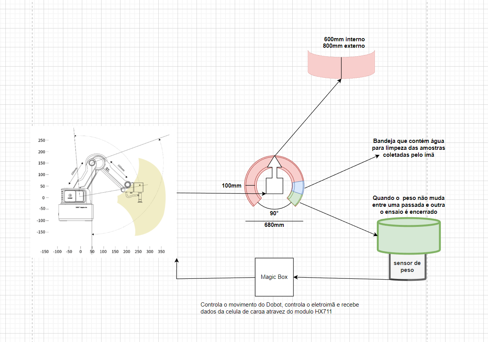
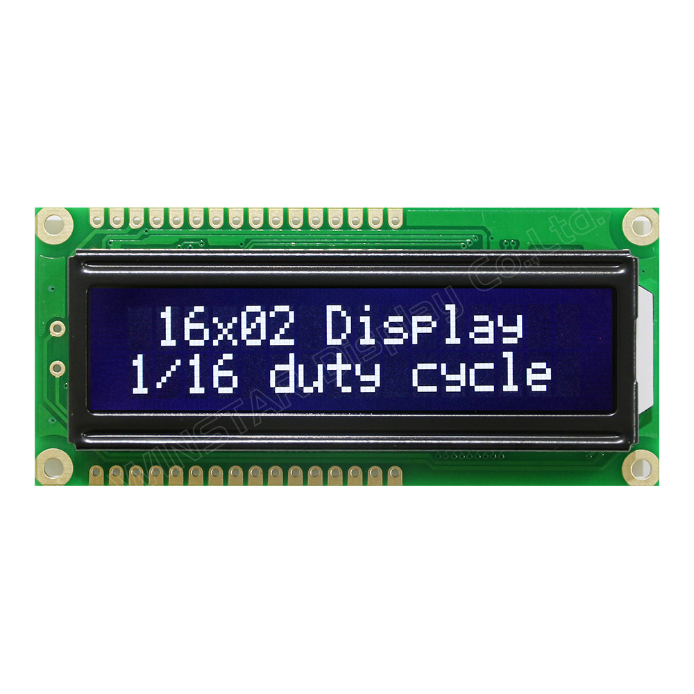

<table>
<tr>
<td>

</td>
<td>
</td>
</tr>
</table>

Concepção de sistema de automação industrial

>*Observação 1: A estrutura inicial deste documento é só um exemplo. O seu grupo deverá alterar esta estrutura de acordo com o que está sendo solicitado nos artefatos.*

>*Observação 2: O índice abaixo não precisa ser editado se você utilizar o Visual Studio Code com a extensão **Markdown All in One**. Essa extensão atualiza o índice automaticamente quando o arquivo é salvo.*

**Conteúdo**

- [Autores](#autores)
- [Visão Geral do Projeto](#visão-geral-do-projeto)
  - [Empresa](#empresa)
  - [O Problema](#o-problema)
  - [Objetivos](#objetivos)
    - [Objetivos gerais](#objetivos-gerais)
    - [Objetivos específicos](#objetivos-específicos)
  - [Partes interessadas](#partes-interessadas)
- [Análise do Problema](#análise-do-problema)
      - [1 — Demonstração do processo manual de separação de amostras realizado pelo IPT.](#1--demonstração-do-processo-manual-de-separação-de-amostras-realizado-pelo-ipt)
      - [2 - Processo manual de separação de amostras realizado pelo IPT.](#2---processo-manual-de-separação-de-amostras-realizado-pelo-ipt)
  - [Dados levantados e analisados relativos ao problema](#dados-levantados-e-analisados-relativos-ao-problema)
  - [Análise da área de atuação](#análise-da-área-de-atuação)
  - [Análise financeira do projeto](#análise-financeira-do-projeto)
  - [Análise das 5 forças de Porter](#análise-das-5-forças-de-porter)
  - [Proposta de Valor: Value Proposition Canvas](#proposta-de-valor-value-proposition-canvas)
  - [Matriz de Risco](#matriz-de-risco)
  - [Matriz de avaliação de valor Oceano Azul](#matriz-de-avaliação-de-valor-oceano-azul)
- [Requisitos do Sistema](#requisitos-do-sistema)
  - [Personas](#personas)
  - [Histórias dos usuários (user stories)](#histórias-dos-usuários-user-stories)
    - [Técnico do laboratório IPT](#técnico-do-laboratório-ipt)
    - [Engenheiro responsável pelo laboratório](#engenheiro-responsável-pelo-laboratório)
- [Arquitetura do Sistema](#arquitetura-do-sistema)
  - [Croqui](#croqui)
  - [Documentação dos componentes](#documentação-dos-componentes)
    - [Componentes](#componentes)
      - [Raspberry Pi pico w](#raspberry-pi-pico-w)
      - [Braço robótico Dobot Magician lite](#braço-robótico-dobot-magician-lite)
      - [Teclado matricial de membrana](#teclado-matricial-de-membrana)
      - [Display LCD](#display-lcd)
      - [Eletroímã](#eletroímã)
      - [Ponte H](#ponte-h)
      - [Célula de peso e módulo Hx711 sensor de peso](#célula-de-peso-e-módulo-hx711-sensor-de-peso)
  - [Especificações dos componentes](#especificações-dos-componentes)
      - [Raspberry Pi pico w](#raspberry-pi-pico-w-1)
      - [Braço robótico Dobot Magician lite](#braço-robótico-dobot-magician-lite-1)
      - [Teclado matricial de membrana](#teclado-matricial-de-membrana-1)
      - [Display LCD](#display-lcd-1)
      - [Eletroímã](#eletroímã-1)
      - [Ponte H](#ponte-h-1)
      - [Célula de peso e módulo Hx711 sensor de peso](#célula-de-peso-e-módulo-hx711-sensor-de-peso-1)
    - [Requisitos de software](#requisitos-de-software)
  - [Tecnologias Utilizadas](#tecnologias-utilizadas)
- [UX e UI Design](#ux-e-ui-design)
  - [Wireframe + Storyboard](#wireframe--storyboard)
  - [Design de Interface](#design-de-interface)
    - [Dimensões e características dos componentes da interface:](#dimensões-e-características-dos-componentes-da-interface)
      - [Teclado de membrana:](#teclado-de-membrana)
      - [Display LCD:](#display-lcd-2)
- [Projeto de Banco de Dados](#projeto-de-banco-de-dados)
  - [Modelo Conceitual](#modelo-conceitual)
  - [Modelo Lógico](#modelo-lógico)
- [Teste de Software](#teste-de-software)
  - [Testes Unitários](#testes-unitários)
    - [Braço mecanico](#braço-mecanico)
    - [Eletroímã](#eletroímã-2)
    - [Módulo de peso](#módulo-de-peso)
  - [Teste de Usabilidade](#teste-de-usabilidade)
- [Análise de Dados](#análise-de-dados)
- [Manuais](#manuais)
  - [Manual de Implantação](#manual-de-implantação)
  - [Manual do Usuário](#manual-do-usuário)
  - [Manual do Administrador](#manual-do-administrador)
- [Referências](#referências)

# Autores

- Jean Lucas Rothstein Machado
- Antonio Angelo Teixeira
- Rafael Nissim Katalan
- Vinicios Venâncio Lugli
- Felipe Henrique Moreira Leão
- Pablo Ruan Lana Viana
- Gustavo Ferreira de Oliveira

# Visão Geral do Projeto

## Empresa

*Descrição_da_empresa*

## O Problema

No início do módulo, foi nos apresentado, durante o processo de exposição do projeto para a turma de Engenharia da Computação do Inteli, o Instituto de Pesquisa Tecnológicas - IPT . Tal projeto traz como principal foco o processo de separação de minérios (imagem 1), ao qual ainda é realizado manualmente por um operador (técnico de laboratório do IPT) que leva em média de 20 – 30 minutos dependendo do tamanho de amostra e concentração de minérios de ferro encontrados na amostra.

## Objetivos

### Objetivos gerais

Com o intuito de aliviar os problemas e as dores apresentadas, produziremos uma solução que emprega um braço mecânico para a automação da tarefa de separação de materiais magnéticos. O técnico precisará apenas inserir a amostra nas bandejas, configurar o campo magnético desejado e supervisionar o procedimento, que será executado automaticamente.

### Objetivos específicos

Para cumprir com o objetivo citado, o robô fará a tarefa de executar a varredura da bandeja inicial da amostra com um eletroímã, que deverá ser ajustado de acordo com o metal que deseja-se obter. Após essa configuração, o robô começará a varrer a amostra, mantendo uma distância e o campo magnético fixos. Em seguida à finalização da varredura, o robô irá submergir em água o que foi coletado, com o intuito de retirar as impurezas que ficaram retidas. Posteriormente, o braço irá se direcionar para a bandeja de coleta, onde o ímã será desativado e a amostra será depositada. O processo será repetido até que toda a amostra seja coletada.

## Partes interessadas

- IPT - Instituto de Pesquisas Tecnológicas.
- INTELI - Instituto de Tecnologia e Liderança.

# Análise do Problema

#### 1 — Demonstração do processo manual de separação de amostras realizado pelo IPT.

  
O processo de separação de amostras atualmente ocorre da seguinte forma: sobre uma mesa são dispostos 3 ímãs de diferentes potenciais (medidos em Gauss); 3 bandejas; 1 saco plástico; 1 recipiente com a amostra (imagem 2). Em todas as 3 bandejas são colocados água para facilitar a manipulação da amostra - na primeira bandeja é despejado a amostra e as outras 2 bandejas irão ser utilizadas como apoio durante o processo de separação manual. Após estas etapas, é escolhido o ímã que mais atrai minérios magnéticos, o qual é envolvido em um plástico (para facilitar a retirada dos materiais de ferros recolhidos pelo ímã).

Após esta fase, o ímã é mergulhado e passa pela bandeja que se encontra com água e a amostra, posteriormente na segunda bandeja só com água e por último solto e armazenado na última bandeja. Este processo é feito várias vezes com o ímã de maior potência e depois  com os outros dois ímãs de menor potência, sendo realizado as etapas da mesma forma.

#### 
2 - Processo manual de separação de amostras realizado pelo IPT.

A necessidade de atualizar este processo vem das grandes demandas de empresas procurando o IPT para realizar testes de separação de minérios em amostra de perfurações realizadas em alguns terrenos. Essas amostras, por sua vez, têm a intenção de analisar a viabilidade do investimento em mineração desses terrenos por meio de algumas métricas pré-estabelecidas, que procuram informações acerca de presença, quantidade e qualidade dos minérios de ferro para extração ponderando viabilidade financeira e ambiental. Algumas das informações almejadas para tal análise são:

1. Concentração de ferro na amostra;
2. Qualidade do minério para determinar a pureza desse;
3. Características geológicas do minério;
4. Quantidade de recursos disponíveis para mineração no local;
5. Riscos ambientais envolvidos com o projeto.

Com a separação magnética feita de forma automática com o braço mecânico, a medição dos minérios poderá ser mais efetiva, e assim, será possível analisar mais facilmente esses parâmetros para viabilização do projeto de mineração do ambiente pretendido.

## Dados levantados e analisados relativos ao problema

Após uma análise da realização da separação pelo técnico de laboratório, é possível perceber que a cada passagem, é gasto aproximadamente 1 minuto. A partir disso, poderemos quantificar se a automação estará trazendo economia de tempo e aumento da produtividade.

Atualmente, o ímã que apresenta o melhor resultado para a separação metálica é de 3000 Gauss, conforme os testes que já foram realizados. No laboratório, há também ímãs de 1500 e 6000 Gauss, que podem ser utilizados de acordo com a amostra que estiver sendo testada.

Existem diferentes tipos de separadores magnéticos, sendo normalmente usados ímãs permanentes, que incluem: ímãs de barra, disco, pulso, rolo, tambor e correia, e dentre esses, os ímãs de barra são utilizados atualmente na separação. Para otimização do processo, esses materiais serão substituídos por eletroímãs que variam o campo magnético para melhor separação dos minérios.
Em relação à taxa de eficiência da separação magnética em minérios, no entanto, pode haver uma variação dependendo de diversos fatores, incluindo a composição mineral do minério, a granulometria, a concentração de minério, a intensidade do campo magnético e o tipo de separador magnético utilizado.

Os metais que despertam o maior interesse da indústria atualmente são o ferro e o cobre. Entretanto, esses metais apresentam uma grande diferença de atração magnética, o que permite que a separação magnética seja bastante efetiva. Como o ferro apresenta um potencial de atração muito alto, um campo magnético muito baixo é o suficiente para atrair as amostras desse tipo de minério. Após a separação desse minério, poderá ser utilizado um campo magnético de intensidade maior, para que o cobre seja atraído com maior facilidade.

## Análise da área de atuação

*Descrição_da_análise_da_área_de_atuação*

## Análise financeira do projeto

O cenário financeiro do parceiro, laboratório de mineração do IPT, atualmente é de 8 análises de solo por mês com cada uma custando na faixa de 3 mil reais. Ainda nesse sentido, podemos considerar o técnico que realiza o processo manual como único custo que deve ser considerado, pois esse será o único custo que, efetivamente, mudará, porque com a automação, o técnico ficará livre para realizar outros trabalhos gerando um valor apenas dependente de suas qualificações.

Por outro lado, com o processo de automatização realizado, o rendimento aumentaria em 25%, passando para 10 amostras analisadas por mês, mantendo-se em 3 mil reais. Dessa maneira, para realizar esse processo, o robô custaria 20 mil reais somado a um kit de 600 reais, que seriam custos únicos, além dos custos por mês de operação, sendo dividido em estruturação e implementação. Os custos de estruturação são de operação com 2,5 mil reais, 4 mil por ano de manutenção e um engenheiro robótico com salário de 20 mil reais. Já no processo de implementação, os custos são: 2,5 mil reais e uma equipe com o engenheiro e três funcionários, totalizando pouco mais de 42 mil reais.

Em última análise, realizando-se os cálculos, chega-se à conclusão que o valor da automação deve custar algo próximo a 90 mil reais, com dois meses de operação. Assim, esse processo se pagaria em torno de 10 meses, pois o aumento de desempenho irá gerar nove mil reais a mais por mês, somando com o que o técnico, que terá mais tempo livre, conseguirá realizar com esse tempo de sobra.

## Análise das 5 forças de Porter

## Proposta de Valor: Value Proposition Canvas

## Matriz de Risco

A partir da análise que realizamos sobre o contexto do projeto, percebemos que os aspectos que gerariam maiores riscos foram relacionados com um funcionamento impreciso da solução, gerado por algum erro durante o processo de desenvolvimento.

Em contrapartida, os aspectos que gerariam maiores oportunidades seriam relacionados com a possibilidade de se obter uma separação mais precisa e com a capacidade de variação do campo magnético .

## Matriz de avaliação de valor Oceano Azul

 

# Requisitos do Sistema

1. Um braço robótico capaz de posicionar um manipulador em posição e distância
controladas sobre a bandeja de amostras;
2. Eletroímã montado no manipulador do braço robótico com campo magnético ajustável
na faixa de 800 a 12.000 Gauss;
3. Estrutura para calibração de posicionamento do braço;
4. Estrutura para calibração de eletroímã;
5. Automação da bandeja de amostra para promover a agitação das partículas;
6. Recipiente com automatização de pesagem para receber material coletado (opcional);
7. Relatório apresentando todos os dados pertinentes do ensaio (opcional).

## Personas

## Histórias dos usuários (user stories)

### Técnico do laboratório IPT

1. Eu, como técnico de laboratório do IPT, desejo poder variar o campo magnético sem mover a distância do ímã para coletar minérios mais ou menos atrativos.
2. Eu, como técnico de laboratório do IPT, desejo que a bandeja vibre e misture a amostra para melhor qualidade do experimento.
3. Eu, como técnico de laboratório do IPT, desejo que a estrutura de bandejas seja removível para maior facilidade de lavagem e remoção de amostras.
4. Eu, como técnico de laboratório do IPT, desejo automatizar o processo de varredura e separação de amostras.
5. Eu, como técnico de laboratório do IPT, desejo dedicar mais meu tempo para pesagem e análise química das amostras.
6. Eu, como técnico de laboratório do IPT, desejo uma interface para uso do robô que seja de fácil utilização e simples manutenção.

### Engenheiro responsável pelo laboratório

1. Eu, como engenheiro responsável pelo laboratório  do IPT, desejo que a amostra analisada seja de maior confiabilidade do que possui hoje em dia.
2. Eu, como engenheiro responsável pelo laboratório  do IPT, desejo que a amostra seja analisada de maneira mais rápida para maior satisfação dos clientes.
3. Eu, como engenheiro responsável pelo laboratório  do IPT, desejo que a aplicação seja de fácil manutenção para não parar por muito tempo o atendimento dos clientes do laboratório.
4. Eu, como engenheiro responsável pelo laboratório  do IPT, desejo que a interface da aplicação seja simples e que eu consiga fazer todas as alterações possíveis por meio de uma tela LCD.

# Arquitetura do Sistema

## Croqui

## Documentação dos componentes

### Componentes 
#### Raspberry Pi pico w
- O Raspberry Pi pico w é um microcontrolador com acesso wireless, o que permite uma conexão via bluetooth e via wifi. Assim ele pode ser  usado para sistemas embarcados e controlar dados de sensores e mandar informações para atuadores sendo fundamental na execução do projeto tanto para enviar como receber os dados.

#### Braço robótico Dobot Magician lite 
- O braço robótico Dobot Magician lite é um robo que apresenta uma interface em software que dá suporte para a programação do hardware, possibilitando a utilização da garra para tarefas diversas tanto em protótipos reais como no estudo de interação entre inteligência artificial e hardware. 

#### Teclado matricial de membrana
- O teclado matricial de membrana é utilizado para projetos que utiizam um teclado alfa numérico que possua ligação com um monitor serial para que seja visivel as respostas de interação através de um monitor serial ligado a ele. 

#### Display LCD
- O display LCD é utilizado para apresentar frases e numeros tendo capacidade de mostrar 16 caracteres em 2 linhas, podendo ser progamado para apresentar dados e informaçoes de sensores ou atuadores ligados a ele, possibilitando assim, a vericação do estágio em que o código se encontra.

#### Eletroímã
 O Eletroimã é um componente eletrônico moderno com funcionalidade básica semelhante a de um imã, porém com a diferença de possuir maior capacidade de atração graças a presença de solenóides. Que através deles, quando expostos a uma tensão é capaz de gerar um campo magnético no seu interior e exterior, podendo controlar este campo a medida que se controla a intesidade da tensão.

 
 #### Ponte H
 - A ponte H é um driver usado em motores de corrente contínua, e que permite o motor girar tanto no sentido horário quanto no sentido anti-horário. Além de permitir alternar o sentido de rotação do motor, ela também exige pouquíssima energia do circuito de comando.

 #### Célula de peso e módulo Hx711 sensor de peso 
 - O Sensor de Peso trata-se de um acessório eletrônico capaz de detectar diferentes cargas que estejam sobre sua meia-ponte, entretanto para funcionamento deve atuar em conjunto com uma plataforma de prototipagem, entre elas, Arduino, PIC, ARM, AVR, entre outros. Como as Células de Carga instalados nas balanças não oferecem dados com grande precisão é necessário o Módulo Conversor HX711 que também funciona como um amplificador de sinal para oferecer dados mais precisos. O Módulo Conversor Amplificador Hx711 de 24bits se comunica através do padrão de comunicação TTL 232, possuindo estrutura simples, fácil de usar e com desempenho estável, além é claro, da elevada sensibilidade e velocidade de medida. 

## Especificações dos componentes
#### Raspberry Pi pico w
- Microcontrolador RP2040 (Silicon Designed by Raspberry Pi)
- Dual-Core ARM Cortex M0+ com clock até 133MHz.
- 264kB de memória SRAM.
- 2MB de memória Flash.
- 26 pinos de GPIO multifunção.
- 2× SPI, 2× I2C, 2× UART, 3× 12-bit ADC e 16× canais PWM.
- Conectividade via WiFi 2.4GHz 802.11n.
- Certificação ANATEL: 134082210629.

#### Braço robótico Dobot Magician lite
- Capacidade de Carga: 250 gramas
- Potência: 60W máx
- Número de eixos: 4
- Alcance Máximo: 340mm
- Posição da Repetibilidade (controle): 0.2mm
- Fonte de Alimentação: 100V~240V, 50/60 Hz.
- Alimentação: 12V/7A DC
- Controle por USB virtual porta serial / Porta serial 

#### Teclado matricial de membrana
– Tensão de operação (máxima): 35VDC
– Corrente de operação (máxima): 100mA
– Quantidade de teclas: 16
– Conector: 8 vias (4 linhas / 4 colunas)
– Isolação: 100V / 100MΩ
– Tempo de contato: 5ms
– Temperatura de operação: 0 a 70° celsius 

#### Display LCD 
- Controlador: HD44780;
- Cor backlight: Azul;
- Cor escrita: Branca;
- Dimensão Total: 80mm X 36mm X 12mm;
- Dimensão Área visível: 64.5mm X 14mm;
- Dimensão Caracter: 3mm X 5.02mm;
- Dimensão Ponto: 0.52mm X 0.54mm.

#### Eletroímã
- Eletroimã / Solenóide 20mm;
- Capacidade de atração elevada;
- Princípo básico de funcionamento semelhante a imã;
- Constituído por solenóides (bobinas cilíndricas);
- Ideal para projetos robóticos e automação residendial.
- Tensão de entrada: 12VDC;
- Capacidade: 2,5Kg;
- Corrente: 0,25A;
- Comprimento do fio: 28cm;
- Diâmetro: 20mm;
- Altura: 15mm;
- Peso: 24g. 

#### Ponte H 
- Tensão de Operação: 4~35v.
- Chip: ST L298N (Datasheet)
- Controle de 2 motores DC ou 1 motor de passo.
- Corrente de Operação máxima: 2A por canal ou 4A max.
- Tensão lógica: 5v.
- Corrente lógica: 0~36mA.
- Limites de Temperatura: -20 a +135°C.
- Potência Máxima: 25W.
#### Célula de peso e módulo Hx711 sensor de peso
- Carga nominal: 1 kg
- Potência nominal de saída: 1.0mv/v ± 0.15mv/v
- Tensão de funcionamento recomendada: 3 ~ 12 VDC
- Tensão máxima de operação: 15 VDC
- Impedância de entrada: 410 +/-30 ohm
- Impedância de saída: 350 +/-3 ohm
- Isolamento: > 2000 megaohm/50 VDC
- Faixa de compensação de temperatura: -10C ~ 40C
- Faixa de temperatura de operação: -20C ~ 60C
- Sobrecarga permitida: <120% da carga nominal
- Carga de ruptura: >150% da carga nominal
- Classe de proteção: IP65
- Material: liga de alumínio
- Dimensões(CxLxA):80mm,12,7mm,12,7mm
- Peso: 31g
- Ligação do fios: Vermelho(+),Preto(-),Verde(Sinal +),Branco(Sinal -)
### Requisitos de software

## Tecnologias Utilizadas

# UX e UI Design

## Wireframe + Storyboard

## Design de Interface 
  A conexão homem máquina da solução do grupo será realizada por meio do LCD, de modo que a interface se mantenha simples e prática, sem a necessidade de outros dispositivos ou acesso à internet. A entrada de dados será feita por um teclado de membrana, por meio do qual o usuário poderá realizar alterações de funcionamento do robô, como ajuste da intensidade de corrente elétrica de acionamento do ímã, distância do braço do robô, assim como sua velocidade, sendo os dois primeiros responsáveis por alterar a intensidade de fluxo magnético produzido pelo ímã e o último apenas a velocidade de varredura.
  Dessa forma, a arquitetura da solução foi idealizada com o intuito de dar maior praticidade ao operador, com a interface completa acoplada ao robô, tendo apenas o cabo de conexão como única distância entre eles. Para isso, o grupo decidiu usar o teclado de membrana como meio de comunicação direta entre o usuário final e o sistema, de modo que cada tecla corresponde a uma ação específica do braço. Somado a isso, o display LCD, associado ao teclado, apresenta o feedback de sucesso ou fracasso dessas ações. 

  

### Dimensões e características dos componentes da interface:

#### Teclado de membrana: 
- Teclas: 16;
- Conector: 8 pinos (2,54mm);
- Montagem: Auto-Adesivo;
- Limites de Operação: 35VDC, 100mA;
- Isolação: 100MΩ, 100V;
- Tempo de contato: 5ms;
- Durabilidade: 1 milhão de ciclos por tecla;
- Temperatura de Funcionamento: 0-70°C;
- Tamanho: 69 x 77 x 0,8mm;
- Comprimento Cabo: 86mm;
- Peso: 10g;

#### Display LCD: 
- Controlador: HD44780;
- Cor backlight: Azul;
- Cor escrita: Branca;
- Dimensão Total: 80mm X 36mm X 12mm;
- Dimensão Área visível: 64.5mm X 14mm;
- Dimensão Caracter: 3mm X 5.02mm;
- Dimensão Ponto: 0.52mm X 0.54mm.

# Projeto de Banco de Dados

## Modelo Conceitual

## Modelo Lógico

# Teste de Software

## Testes Unitários

### Braço mecanico 
Para a primeira versão do protótipo do braço mecânico, foi construído um código-fonte que permitisse a comunicação entre o braço mecânico e um computador atraves do controle de seus eixos X, Y e Z por meio de um controle de Xbox. A escolha do controle de Xbox foi feita, inicialmente, pelo fato de ser o que chega ao mais próximo de nosso interface proposta, já que ambos se comunicarem por meio de um cabo a um receptor de entrada/saída (computador). Sendo assim, realizamos teste de movimentação ao qual notamos os seguintes problemas/ delimitações do Dobot Magician:

1. Limites máximo de movimentação:

- Ao atingirmos o limite máximo do braço mecânico, nos ângulos -135° e 135°, o Dobot Magician acaba travando e sendo necessário realizar o desligamento e ligamento do braço mecânico para voltar a utilizar novamente.

2. Movimentação forçada do braço mecânico (batidas ou movimentações manuais):

- O mesmo travamento acontece quando está ocorrendo a execução de um determinado código-fonte no braço mecânico, por algum evento acabe ocorrendo uma movimentação forçada (batida ou reajuste no braço mecânico manualmente). Sendo assim, para a construção de códigos-fonte de execução de processos mais complexo há a necessidade de tratamento para estes possíveis acontecimentos.

### Eletroímã

A construção do eletroímã foi realizado por meio da ligação de dois eletroímãs à uma ponte H, por meio disto podemos testar três níveis inicias de intercidades do campo magnético passado energia manualmente pela fonte digital. Desta forma, concluímos que a utilização de apenas um eletroímã, não ira conseguir cobrir uma área tão grande durante a varredura do processo de separação da amostra. Sendo assim, partimos do pressuposto que a utilização de dois eletroímãs, iria conseguir atingir o nosso objetivo proposto, esse teste também nos possibilitou realizar o teste de velocidade de execução do braço com o peso de dois eletroímãs. Ao qual vimos que talvez haja a necessidade de dividirmos o processo de varredura da separação de amostras por quadrantes, já que devemos 
considerar o peso dos eletroímãs com o coletado da amostra.

### Módulo de peso
Também durante está sprint 2, realizamos a construção do módulo de peso que serviram como uma das peças principais do nosso protótipo, pois serviram como mecanismo de parado do processo de separação de amostra. Durante a contrição, notamos a dificuldade de achar exemplos de construção do mesmo por meio da linguagem de programação Python. Apenas encontrado, exemplos de construções realizadas em C, por meio deste, notamos que talvez para a nossa solução, teremos que mudar a linguagem de programação, sendo adotada a linguagem C. 

Também, notamos que inicialmente, para pesos maiores, o modulo de peso conseguem capturar os valores, mas para valores menores não consegue capturar com tanta precisão (este processo de teste foi realizado com parafusos e porcas). Desta forma, não podemos distinguir se esta limitação ocorre devido ao módulo ou pelo código-fonte, necessitando realizar teste com a amostra disponibilizada recentemente.

## Teste de Usabilidade

# Análise de Dados

# Manuais

## Manual de Implantação

## Manual do Usuário

## Manual do Administrador

# Referências