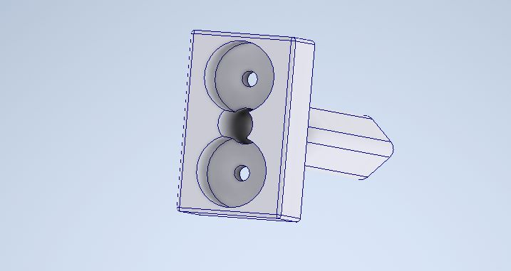

<table>
<tr>
<td>

</td>
<td>
</td>
</tr>
</table>

Concepção de sistema de automação industrial

> _Observação 1: A estrutura inicial deste documento é só um exemplo. O seu grupo deverá alterar esta estrutura de acordo com o que está sendo solicitado nos artefatos._

> _Observação 2: O índice abaixo não precisa ser editado se você utilizar o Visual Studio Code com a extensão **Markdown All in One**. Essa extensão atualiza o índice automaticamente quando o arquivo é salvo._

**Conteúdo**

- [Autores](#autores)
- [Visão Geral do Projeto](#visão-geral-do-projeto)
  - [Empresa](#empresa)
  - [O Problema](#o-problema)
  - [Objetivos](#objetivos)
    - [Objetivos gerais](#objetivos-gerais)
    - [Objetivos específicos](#objetivos-específicos)
  - [Partes interessadas](#partes-interessadas)
- [Análise do Problema](#análise-do-problema)
  - [Dados levantados e analisados relativos ao problema](#dados-levantados-e-analisados-relativos-ao-problema)
  - [Análise financeira do projeto](#análise-financeira-do-projeto)
  - [Análise das 5 forças de Porter](#análise-das-5-forças-de-porter)
    - [Fornecedores:](#fornecedores)
    - [Consumidores:](#consumidores)
    - [Entraves de de entrada](#entraves-de-de-entrada)
    - [Concorrentes diretos:](#concorrentes-diretos)
    - [Substitutos:](#substitutos)
  - [Visualização de 5 forças de Porter detalhada](#visualização-de-5-forças-de-porter-detalhada)
  - [Proposta de Valor: Value Proposition Canvas](#proposta-de-valor-value-proposition-canvas)
    - [Produto:](#produto)
    - [Cliente](#cliente)
  - [Matriz de Risco](#matriz-de-risco)
  - [Matriz de avaliação de valor Oceano Azul](#matriz-de-avaliação-de-valor-oceano-azul)
- [Requisitos do Sistema](#requisitos-do-sistema)
  - [Personas](#personas)
  - [Histórias dos usuários (user stories) 2](#histórias-dos-usuários-user-stories-2)
    - [Técnico do laboratório IPT](#técnico-do-laboratório-ipt)
    - [Engenheiro responsável pelo laboratório](#engenheiro-responsável-pelo-laboratório)
- [Arquitetura do Sistema](#arquitetura-do-sistema)
  - [Croqui](#croqui)
  - [Documentação dos componentes](#documentação-dos-componentes)
    - [Esquema Geral dos Componentes](#esquema-geral-dos-componentes)
    - [Componentes](#componentes)
      - [Braço Robótico Dobot Magician Lite](#braço-robótico-dobot-magician-lite)
      - [Especificações do Braço Robótico Dobot Magician Lite:](#especificações-do-braço-robótico-dobot-magician-lite)
      - [Eletroímã:](#eletroímã)
      - [Especificações do Eletroímã:](#especificações-do-eletroímã)
      - [Célula de Peso e Módulo Hx711 Sensor de Peso:](#célula-de-peso-e-módulo-hx711-sensor-de-peso)
      - [Especificações do Célula de Peso e Módulo Hx711 Sensor de Peso:](#especificações-do-célula-de-peso-e-módulo-hx711-sensor-de-peso)
      - [Ponte H](#ponte-h)
    - [Módulos funcionais do sistema](#módulos-funcionais-do-sistema)
      - [Projeto dos dispositivos mecânicos](#projeto-dos-dispositivos-mecânicos)
    - [Projeto da bandeja circular](#projeto-da-bandeja-circular)
  - [Materiais:](#materiais)
    - [Filamento PLA:](#filamento-pla)
    - [Especificações:](#especificações)
    - [Método de fabricação dos projetos mecânicos:](#método-de-fabricação-dos-projetos-mecânicos)
    - [Projeto dos dispositivos Eletrônicos](#projeto-dos-dispositivos-eletrônicos)
      - [Pinagem Magic Box:](#pinagem-magic-box)
      - [Esquemático célula de peso:](#esquemático-célula-de-peso)
      - [Portas do Magic Box](#portas-do-magic-box)
- [Planejamento e método de fabricação:](#planejamento-e-método-de-fabricação)
  - [Descrição do Hardware](#descrição-do-hardware)
    - [Requisitos de software](#requisitos-de-software)
- [UX e UI Design](#ux-e-ui-design)
  - [Design de Interface](#design-de-interface)
- [Validação Magic Box](#validação-magic-box)
  - [Áreas de atuação](#áreas-de-atuação)
    - [1. Comunicação eletroimã](#1-comunicação-eletroimã)
    - [2. Comunicação celula de peso](#2-comunicação-celula-de-peso)
    - [3. Atuação como microcontrolador](#3-atuação-como-microcontrolador)
- [Validação dispositivos mecânicos](#validação-dispositivos-mecânicos)
  - [Protótipos](#protótipos)
  - [Validação em testes](#validação-em-testes)
- [Teste de Software](#teste-de-software)
  - [Testes Unitários](#testes-unitários)
    - [Sprint 2](#sprint-2)
      - [Braço mecânico](#braço-mecânico)
      - [Eletroímã](#eletroímã)
      - [Módulo de peso](#módulo-de-peso)
    - [Sprint 3](#sprint-3)
      - [Braço Robótico e Magic Box](#braço-robótico-e-magic-box)
      - [Eletroímã e Magic Box](#eletroímã-e-magic-box)
      - [Mapeamento e pinagem do Magic Box](#mapeamento-e-pinagem-do-magic-box)
    - [Sprint 4](#sprint-4)
      - [Buzzer](#buzzer)
      - [Alteração do Campo Magnético](#alteração-do-campo-magnético)
      - [Modulo de peso e Magic Box](#modulo-de-peso-e-magic-box)
      - [Suporte para o eletroímã](#suporte-para-o-eletroímã)
      - [Movimentação do Braço Robótico](#movimentação-do-braço-robótico)
    - [Sprint 5](#sprint-5)
      - [Ponte H - O retorno!](#ponte-h-o-retorno)
        - [Contexto](#contexto)
        - [Problema e solução atual](#problema-e-solução-atual)
        - [Possível solução para o problema base](#possível-solução-para-o-problema-base)
  - [Teste de Usabilidade](#teste-de-usabilidade)
- [Manuais](#manuais)
  - [Manual de Implantação](#manual-de-implantação)
  - [Manual do Usuário](#manual-do-usuário)
- [Referências](#referências)

# Autores

- Jean Lucas Rothstein Machado
- Antonio Angelo Teixeira
- Rafael Nissim Katalan
- Vinicios Venâncio Lugli
- Felipe Henrique Moreira Leão
- Pablo Ruan Lana Viana
- Gustavo Ferreira de Oliveira

# Visão Geral do Projeto

## Empresa

O IPT (Instituto de Pesquisas Tecnológicas) é uma organização de pesquisa, desenvolvimento e inovação, vinculada ao Governo do Estado de São Paulo. As áreas de atuação do IPT são bastante diversificadas, produzindo soluções de engenharia, materiais, meio ambiente, energia, e saúde. O instituto é reconhecido nacional e internacionalmente pela excelência técnica e qualidade de seus serviços, e principalmente, pela capacidade de inovação.

No setor de mineração, o IPT desenvolve pesquisas e desenvolvimento de tecnologias para essa indústria, e utiliza seus laboratórios e equipamentos principalmente para a realização de ensaios e análises de amostras de minérios, separação de minerais e estudos de solos com potencial de extração mineral.

## O Problema

No início do módulo, foi nos apresentado, durante o processo de exposição do projeto para a turma de Engenharia da Computação do Inteli, o Instituto de Pesquisa Tecnológicas - IPT . Tal projeto traz como principal foco o processo de separação de minérios (imagem 1), ao qual ainda é realizado manualmente por um operador (técnico de laboratório do IPT) que leva em média de 20 – 30 minutos dependendo do tamanho de amostra e concentração de minérios de ferro encontrados na amostra.

## Objetivos

### Objetivos gerais

Com o intuito de aliviar os problemas e as dores apresentadas, produziremos uma solução que emprega um braço robótico (Magician Lite) para a automação da tarefa de separação de materiais magnéticos. O técnico precisará apenas inserir a amostra nas bandejas, configurar o campo magnético desejado e supervisionar o procedimento, que será executado automaticamente.

### Objetivos específicos

Para cumprir com o objetivo citado, os seguintes objetivos específicos devem ser concluídos:

- O braço robótico fará a tarefa de executar a varredura da bandeja inicial da amostra com um eletroímã, que deverá ser ajustado conforme o metal que deseja-se obter;
- O braço robótico também deverá começar a varrer a amostra, mantendo uma distância e o campo magnético fixos;
- Após a conclusão da varredura, o robô irá submergir em água o que foi coletado, com o intuito de retirar as impurezas que ficaram retidas;
- Posteriormente, o braço irá se direcionar para a bandeja de coleta, onde o ímã será desativado e a amostra será depositada;
- O processo será repetido até que toda a amostra seja coletada.

## Partes interessadas

- IPT - Instituto de Pesquisas Tecnológicas.
- INTELI - Instituto de Tecnologia e Liderança.

# Análise do Problema

No início do módulo, foi nos apresentado, durante o processo de exposição do projeto para a turma de Engenharia da Computação do Inteli, o Instituto de Pesquisa Tecnológicas - IPT . Tal projeto traz como principal foco o processo de separação de minérios (imagem 1), ao qual ainda é realizado manualmente por um operador (técnico de laboratório do IPT) que leva em média de 20 – 30 minutos dependendo do tamanho de amostra e concentração de minérios de ferro encontrados na amostra.

 1 — Demonstração do processo manual de separação de amostras realizado pelo IPT.

 
O processo de separação de amostras atualmente ocorre da seguinte forma: sobre uma mesa são dispostos 3 ímãs de diferentes potenciais (medidos em Gauss); 3 bandejas; 1 saco plástico; 1 recipiente com a amostra (imagem 2). Em todas as 3 bandejas são colocados água para facilitar a manipulação da amostra - na primeira bandeja é despejado a amostra e as outras 2 bandejas irão ser utilizadas como apoio durante o processo de separação manual. Após estas etapas, é escolhido o ímã que mais atrai minérios magnéticos, o qual é envolvido em um plástico (para facilitar a retirada dos materiais de ferros recolhidos pelo ímã).

Após esta fase, o ímã é mergulhado e passa pela bandeja que se encontra com água e a amostra, posteriormente na segunda bandeja só com água e por último solto e armazenado na última bandeja. Este processo é feito várias vezes com o ímã de maior potência e depois com os outros dois ímãs de menor potência, sendo realizado as etapas da mesma forma.

 2 - Processo manual de separação de amostras realizado pelo IPT.

 

A necessidade de atualizar este processo vem das grandes demandas de empresas procurando o IPT para realizar testes de separação de minérios em amostra de perfurações realizadas em alguns terrenos. Essas amostras, por sua vez, têm a intenção de analisar a viabilidade do investimento em mineração desses terrenos por meio de algumas métricas pré-estabelecidas, que procuram informações acerca de presença, quantidade e qualidade dos minérios de ferro para extração ponderando viabilidade financeira e ambiental. Algumas das informações almejadas para tal análise são:

1. Concentração de ferro na amostra;
2. Qualidade do minério para determinar a pureza desse;
3. Características geológicas do minério;
4. Quantidade de recursos disponíveis para mineração no local;
5. Riscos ambientais envolvidos com o projeto.

Com a separação magnética feita de forma automática com o braço robótico (Magician Lite), a medição dos minérios poderá ser mais efetiva, e assim, será possível analisar mais facilmente esses parâmetros para viabilização do projeto de mineração do ambiente pretendido.

## Dados levantados e analisados relativos ao problema

Após uma análise da realização da separação pelo técnico de laboratório, é possível perceber que a cada passagem, é gasto aproximadamente 1 minuto. A partir disso, poderemos quantificar se a automação estará trazendo economia de tempo e aumento da produtividade.

Atualmente, o ímã que apresenta o melhor resultado para a separação metálica é de 3000 Gauss, conforme os testes que já foram realizados. No laboratório, há também ímãs de 1500 e 6000 Gauss, que podem ser utilizados de acordo com a amostra que estiver sendo testada.

Existem diferentes tipos de separadores magnéticos, sendo normalmente usados ímãs permanentes, que incluem: ímãs de barra, disco, pulso, rolo, tambor e correia, e dentre esses, os ímãs de barra são utilizados atualmente na separação. Para otimização do processo, esses materiais serão substituídos por eletroímãs que variam o campo magnético para melhor separação dos minérios.
Em relação à taxa de eficiência da separação magnética em minérios, no entanto, pode haver uma variação dependendo de diversos fatores, incluindo a composição mineral do minério, a granulometria, a concentração de minério, a intensidade do campo magnético e o tipo de separador magnético utilizado.

Os metais que despertam o maior interesse da indústria atualmente são o ferro e o cobre. Entretanto, esses metais apresentam uma grande diferença de atração magnética, o que permite que a separação magnética seja bastante efetiva. Como o ferro apresenta um potencial de atração muito alto, um campo magnético muito baixo é o suficiente para atrair as amostras desse tipo de minério. Após a separação desse minério, poderá ser utilizado um campo magnético de intensidade maior, para que o cobre seja atraído com maior facilidade.

## Análise financeira do projeto

O cenário financeiro do parceiro, laboratório de mineração do IPT, atualmente é de 8 análises de solo por mês com cada uma custando na faixa de 3 mil reais. Ainda nesse sentido, podemos considerar o técnico que realiza o processo manual como único custo que deve ser considerado, pois esse será o único custo que, efetivamente, mudará, porque com a automação, o técnico ficará livre para realizar outros trabalhos gerando um valor apenas dependente de suas qualificações.

Por outro lado, com o processo de automatização realizado, o rendimento aumentaria em 25%, passando para 10 amostras analisadas por mês, mantendo-se em 3 mil reais. Dessa maneira, para realizar esse processo, o robô custaria 20 mil reais somado a um kit de 600 reais, que seriam custos únicos, além dos custos por mês de operação, sendo dividido em estruturação e implementação. Os custos de estruturação são de operação com 2,5 mil reais, 4 mil por ano de manutenção e um engenheiro robótico com salário de 20 mil reais. Já no processo de implementação, os custos são: 2,5 mil reais e uma equipe com o engenheiro e três funcionários, totalizando pouco mais de 42 mil reais.

Em última análise, realizando-se os cálculos, chega-se à conclusão que o valor da automação deve custar algo próximo a 90 mil reais, com dois meses de operação. Assim, esse processo se pagaria em torno de 10 meses, pois o aumento de desempenho irá gerar nove mil reais a mais por mês, somando com o que o técnico, que terá mais tempo livre, conseguirá realizar com esse tempo de sobra.

## Análise das 5 forças de Porter

- As 5 forças de Porter é uma análise feita em relação a como a empresa se encontra no ecossistema empresarial, levantando pontos relacionados aos seus principais stakeholder e como eles influenciam no desenvolvimento dela. Entre eles estão:

### Fornecedores:

- Eles possuem a influência na distribuição de insumos ou serviços necessários para as operações da empresa, sendos eles no contexto do IPT fornecedores de peças e materiais para construção de circuitos eletronicos, microprocessadores e materias gerais para a realização dos teste.

### Consumidores:

- Eles possuem a influência na receita da empresa pela escolha de adquirir ou não o produto, para o IPT as empresas e instituições que fecham contratos com eles são importantes não só pelo funcionamento e mantimento das operações da empresa, mas para o incentivo de constante melhoria tendo em vista o grande aumento de tecnologia na área de análises e pesquisas para diversas áreas.

### Entraves de de entrada

- São os desafios das empresas que pretendem entrar nesse setor, analisando o setor do IPT um dos principais entraves é o auto investimento em infraestrutura para realizar as pesquisas, além da necessidade de mão de obra qualificada que aumenta a demanda de uma relação próxima com universidades e o valor a ser investido nos serviços desses profissionais.

### Concorrentes diretos:

- São empresas que possuem produtos ou serviços do mesmo setor e com a mesma finalidade. A princípio, os concorrentes diretos do IPT são outros intituos como ITA e IME, mas algumas empresas privadas também fornecem os mesmo produtos de testes e pesquisas podendo elas serem comcorrentes diretos.

### Substitutos:

- São empresas que possuem produtos que não são do mesmo setor mas possuem soluções que se aplicam para as dores do setor. Algumas empresas privadas que encontramos em uma pesquisa sobre produtos similares à análise do solo para mineração fornecem esse tipo de serviços mas de maneira diferente e não só para esse propósito podendo atuar como produtos substitutos.

## Visualização de 5 forças de Porter detalhada

 

## Proposta de Valor: Value Proposition Canvas

- O canvas proposition é uma ferramenta que auxilia na criação do produto em relação as espectativa e demandas do cliente, ele é fundamental para o entendimento de como a solução será relevante e validar algumas hipóteses sobre o produto. Essa ferreamenta é divida em dois pontos sobre o produto e sobre o cliente. Esses pontos servem para nortear os tópicos relevantes ao produto e quais são relevantes ao cliente.

### Produto:

1. Aliviador de dores: Os aliviadores de dores tem correspondência com as dores e explicitam a forma como o produto resolve as dores de maneira direta do cliente.
2. Produtos e serviços: Essa área são as especifações gerais do produto, o que ele é de fato.
3. Criadores de ganhos: Eles são os ganhos indiretos que a solução propõe para o cliente e agrega valor intriseco a ele.

### Cliente

1. Dores: São os problemas do cliente diretamente exemplificado o que ele precisa que seja solucionado.
2. Tarefas do cliente: São instruções que o cliente precisa fazer ou para a solução funcionar ou para que ela auxilie ele na resolução das dores.
3. Ganhos: Valor agregado do produto que irá impactar diretamente o cliente.

 

## Matriz de Risco

A partir da análise que realizamos sobre o contexto do projeto, percebemos que os aspectos que gerariam maiores riscos foram relacionados com um funcionamento impreciso da solução, gerado por algum erro durante o processo de desenvolvimento.

Em contrapartida, os aspectos que gerariam maiores oportunidades seriam relacionados com a possibilidade de se obter uma separação mais precisa e com a capacidade de variação do campo magnético.

## Matriz de avaliação de valor Oceano Azul

A matriz de oceano Azul é uma análise feita sobre a empresa e a solução proposta, em relação a outras empresas e soluções parecidas. A matriz leva em consideração alguns atributos como: Preço, qualidade, tecnologia, conforto, comodidade e praticidade. Assim, através desses atributos é classificado de 0 a 10 o valor desses atributos em relação as empresas e a solução.

 
 

# Requisitos do Sistema

1. Um braço robótico capaz de posicionar um manipulador em posição e distância
   controladas sobre a bandeja de amostras;
2. Eletroímã montado no manipulador do braço robótico com campo magnético ajustável
   na faixa de 800 a 12.000 Gauss;
3. Estrutura para calibração de posicionamento do braço;
4. Estrutura para calibração de eletroímã;
5. Automação da bandeja de amostra para promover a agitação das partículas;
6. Recipiente com automatização de pesagem para receber material coletado (opcional);
7. Relatório apresentando todos os dados pertinentes do ensaio (opcional).

## Personas

 

## Histórias dos usuários (user stories) 2

### Técnico do laboratório IPT

1. Eu, como técnico de laboratório do IPT, desejo poder variar o campo magnético sem mover a distância do ímã para coletar minérios mais ou menos atrativos.
2. Eu, como técnico de laboratório do IPT, desejo que a bandeja vibre e misture a amostra para melhor qualidade do experimento.
3. Eu, como técnico de laboratório do IPT, desejo que a estrutura de bandejas seja removível para maior facilidade de lavagem e remoção de amostras.
4. Eu, como técnico de laboratório do IPT, desejo automatizar o processo de varredura e separação de amostras.
5. Eu, como técnico de laboratório do IPT, desejo dedicar mais meu tempo para pesagem e análise química das amostras.
6. Eu, como técnico de laboratório do IPT, desejo uma interface para uso do robô que seja de fácil utilização, não precise de acesso à internet e tenha simples manutenção.

### Engenheiro responsável pelo laboratório

1. Eu, como engenheiro responsável pelo laboratório do IPT, desejo que a amostra analisada seja de maior confiabilidade do que possui hoje em dia.
2. Eu, como engenheiro responsável pelo laboratório do IPT, desejo que a amostra seja analisada de maneira mais rápida para maior satisfação dos clientes.
3. Eu, como engenheiro responsável pelo laboratório do IPT, desejo que a aplicação seja de fácil manutenção para não parar por muito tempo o atendimento dos clientes do laboratório.
4. Eu, como engenheiro responsável pelo laboratório do IPT, desejo que a interface da aplicação seja simples e que eu consiga fazer todas as alterações possíveis por meio do MagicBox para apenas configurar o campo magnético, iniciar os ciclos de varredura e aferir o peso da amostra.

# Arquitetura do Sistema

## Croqui

Um croqui trata-se de um método de representação gráfica, utilizado principalmente por arquitetos, engenheiros e designers para esboçar ideias e conceitos visualmente. O objetivo do croqui é transmitir uma ideia de forma rápida e intuitiva, permitindo que o criador possa explorar diferentes possibilidades e testar soluções de forma prática. Neste sentido, o croqui foi uma ferramenta fundamental para o processo criativo da solução proposta pelo grupo. O projeto consiste na criação de um sistema automatizado de ensaio para análise de amostras de metal retiradas do solo, utilizando o braço robótico Dobot Magician Lite.

Para otimizar a movimentação do braço, serão utilizadas três bandejas dispostas radialmente, permitindo maior velocidade de execução e reduzindo travamentos. Dessa maneira, a primeira bandeja será destinada à amostra bruta, a segunda será uma bandeja com água para limpar possíveis resíduos não magnéticos que foram puxados acidentalmente pelo eletroímã e a terceira será para a amostra limpa. Para controle dos componentes, será utilizado o Magic-Box, eliminando a necessidade de um servidor externo e permitindo ao cliente acesso às configurações do ensaio através de botões e display embutidos. Além disso, será adicionado um sensor de peso à terceira bandeja, responsável pela amostra limpa que, a cada rodada, realizará a pesagem e finaliza o ensaio quando não houver alteração na aferição desse peso.

Para captar as amostras com o braço robótico, será adicionado um eletroímã, que será regulado por uma ponte H externa conectada ao Magic Box por meio de um cabo PWM, permitindo a regulagem da força magnética e inversão da mesma. Espera-se obter, com a implementação dessas características, um sistema de ensaio automatizado eficiente e de fácil utilização. Um croqui deste sistema pode ser visto na figura abaixo:

## Documentação dos componentes

### Esquema Geral dos Componentes

### Componentes

#### Braço Robótico Dobot Magician Lite

- O braço robótico Dobot Magician lite é um robo que apresenta uma interface em software que dá suporte para a programação do hardware, possibilitando a utilização da garra para tarefas diversas tanto em protótipos reais como no estudo de interação entre inteligência artificial e hardware.

 

#### Especificações do Braço Robótico Dobot Magician Lite:

- Capacidade de Carga: 250 gramas
- Potência: 60W máx
- Número de eixos: 4
- Alcance Máximo: 340mm
- Posição da Repetibilidade (controle): 0.2mm
- Fonte de Alimentação: 100V~240V, 50/60 Hz.
- Alimentação: 12V/7A DC
- Controle por USB virtual porta serial / Porta serial

#### Eletroímã:

O Eletroimã é um componente eletrônico moderno com funcionalidade básica semelhante a de um imã, porém com a diferença de possuir maior capacidade de atração graças a presença de solenóides. Que através deles, quando expostos a uma tensão é capaz de gerar um campo magnético no seu interior e exterior, podendo controlar este campo a medida que se controla a intesidade da tensão.

 

 

#### Especificações do Eletroímã:

- Eletroimã / Solenóide 20mm;
- Capacidade de atração elevada;
- Princípo básico de funcionamento semelhante a imã;
- Constituído por solenóides (bobinas cilíndricas);
- Ideal para projetos robóticos e automação residendial.
- Tensão de entrada: 12VDC;
- Capacidade: 2,5Kg;
- Corrente: 0,25A;
- Comprimento do fio: 28cm;
- Diâmetro: 20mm;
- Altura: 15mm;
- Peso: 24g.

#### Célula de Peso e Módulo Hx711 Sensor de Peso:

O Sensor de Peso trata-se de um acessório eletrônico capaz de detectar diferentes cargas que estejam sobre sua meia-ponte, entretanto para funcionamento deve atuar em conjunto com uma plataforma de prototipagem, entre elas, Arduino, PIC, ARM, AVR, entre outros. Como as Células de Carga instalados nas balanças não oferecem dados com grande precisão é necessário o Módulo Conversor HX711 que também funciona como um amplificador de sinal para oferecer dados mais precisos. O Módulo Conversor Amplificador Hx711 de 24bits se comunica através do padrão de comunicação TTL 232, possuindo estrutura simples, fácil de usar e com desempenho estável, além é claro, da elevada sensibilidade e velocidade de medida.

 

#### Especificações do Célula de Peso e Módulo Hx711 Sensor de Peso:

- Carga nominal: 1 kg
- Potência nominal de saída: 1.0mv/v ± 0.15mv/v
- Tensão de funcionamento recomendada: 3 ~ 12 VDC
- Tensão máxima de operação: 15 VDC
- Impedância de entrada: 410 +/-30 ohm
- Impedância de saída: 350 +/-3 ohm
- Isolamento: > 2000 megaohm/50 VDC
- Faixa de compensação de temperatura: -10C ~ 40C
- Faixa de temperatura de operação: -20C ~ 60C
- Sobrecarga permitida: <120% da carga nominal
- Carga de ruptura: >150% da carga nominal
- Classe de proteção: IP65
- Material: liga de alumínio
- Dimensões(CxLxA):80mm,12,7mm,12,7mm
- Peso: 31g
- Ligação do fios: Vermelho(+),Preto(-),Verde(Sinal +),Branco(Sinal -)

#### Ponte H

A ponte h é um circuito integrado que será utilizado para a variação de campo magnéctico atrávé da variação da corrente. Essa variação será controlada através do software projeta para atuar como comunição entre o Magic Box e a ponte h. Sendo assim, possivel desligar e ligar o imã atráves da inversão de campo pela inversão de sentido da corrente.

 

#### Especificações do Ponte H:

- Tensão de Operação: 4~35v.
- Chip: ST L298N (Datasheet)
- Controle de 2 motores DC ou 1 motor de passo.
- Corrente de Operação máxima: 2A por canal ou 4A max.
- Tensão lógica: 5v.
- Corrente lógica: 0~36mA.
- Limites de Temperatura: -20 a +135°C.
- Potência Máxima: 25W.

### Módulos funcionais do sistema

#### Projeto dos dispositivos mecânicos

Encaixe do ímã: Estrutura para encaixe do ímã para acoplação com o braço robô, utilizando o encaixe para segurar caneta presente no kit Dobot Magician Lite. Dessa forma, produziremos uma estrutura em formato cilíndrico, (semelhante à caneta), que possuirá um furo superior para entrada de um parafuso, que servirá como ligação entre a estrutura e o eletroíma, pois será encaixado na entrada de parafuso M4 presente no eletroímã.
Bandejas em formato circular: Bandejas que serão fabricadas em um formato circular específico para suprir o movimento do braço e torná-lo mais eficiente.

 

### Projeto da bandeja circular

Para a fabricação das bandejas será utilizada uma placa de poliestireno de 1m de largura por 1m de comprimento. A partir do ângulo de movimentação do braço mecânico, foram tiradas as medidas de abrangência do arco de varredura que será feito pelo braço, que no caso será um ângulo de 270° a partir da base do braço fixado. Dessa forma, a placa possuirá um formato circular com vários cortes para molduragem de 3 bandejas com 8,4 cm de profundidade, 15 cm de largura e comprimentos diferentes para as 3 partes do processo de separação magnética, as quais serão:

- A primeira bandeja possuirá 89,9 cm de comprimento externo e 54,6 cm de comprimento interno;
- A segunda bandeja possuirá 26,9 cm de comprimento externo e 16,4 cm de comprimento interno;
- A terceira bandeja possuirá 63,0 cm de comprimento externo e 38,2 cm de comprimento interno.

A figura abaixo mostra o projeto das peças para molduragem da bandeja:

 

Dessa forma, a primeira estrutaração para fabricação da bandeja foi pensada da seguinte forma:

- As primeiras peças de montagem são as bases das bandejas, que serão cortadas na cortadora a laser nessa sequência:

Base da bandeja que depositará a amostra misturada;

 

Base da bandeja na qual o braço limpará resíduos acoplados no imã, separando os materiais magnéticos e não magnéticos;

 

Base da bandeja em que será depositada a amostra já separada e limpa, apenas com materiais magnéticos;

 

- As peças que foram pensadas para serem as paredes, tanto externas quanto internas, serão cortadas de forma retangular e depois dobradas com um soprador térmico;

- Paredes externas da estrutura da bandeja em ordem de varredura do braço;

  - Parede externa da base da bandeja que contém a amostra misturada;
  

  
  

  - Parede externa da base da bandeja que serve para limpeza da amostra acoplada ao ímã;

  

  
  

  - Parede externa da base da bandeja que serve para depositar a amostra separada;
  

  
  

- Paredes internas da estrutura da bandeja em ordem de varredura do braço;

  - Parede interna da base da bandeja que contém a amostra misturada;
  

  
  

  - Parede interna da base da bandeja que serve para limpeza da amostra acoplada ao ímã;
  

  
  

  - Parede interna da base da bandeja que serve para depositar a amostra separada;
  

  
  

- Para separar as bandejas, o grupo chegou a conclusão de divisórias quadradas entre as bandejas;

 

- Com isso, visando padronizar todos os ensaios, foi decidido que o robô precisaria de um encaixe, para que todos os ensaios realizados tenham a mesma varredura e as mesmas posições das bendejas;

 

## Materiais:

### Filamento PLA:

### Especificações:

- Matéria-prima: Poliácido Láctico
- Diâmetro do filamento: 1,75 mm ± 0,05 mm
- Dimensões do carretel: 20 cm x 6 cm (D x A)
- Diâmetro do furo do carretel: ± 48,6 mm
- Temperatura de impressão: 190º C - 215º C
- Temperatura da mesa: > 59º C

### Método de fabricação dos projetos mecânicos:

- A lista de materiais feita utilizará diferentes métodos para fabricação dos componentes presentes. Nesse sentido, o encaixe do ímã será feito com uma impressora 3D e o filamento de resina citado na lista de materiais, além disso, como seu modelo já está pronto, basta utilizar um programa de design 3D para gerar sua estrutura.

- Por sua vez, as bandejas em formato circular serão fabricadas a fim de otimizar a movimentação do robô, fabricando-as no formato que o Dobot Magician Lite varre de forma mais eficiente, com atuação de um número menor de eixos e de forma a economizar tempo em cada análise. Dessa maneira, para podermos manipular o formato das bandejas de poliestileno, o grupo decidiu por utilizar um cortador a laser, os quais provaram-se ser um método mais eficiente para o objetivo do que a impressão 3D.

### Projeto dos dispositivos Eletrônicos

- As placas que serão utilizadas será apena a placa de circuito integrada para o módulo de peso e a célula de carga.
- O esquemático da célula de peso, os cabos serão todos conectados em uma porta do Magic box sendo eles apresentados no esquemático abaixo. O cabo de cor preta será ligado na porta do GND, o cabo de cor vermelha será ligado na entrada de 5V, o cabo verde será ligado na porta EIO16, o cabo azul será ligado na entrada EIO15.
- Para a construção da balança será usada uma célula de carga que é um sensor de peso com capacidade de 5kg que será utilizado para fazer a pesagem da amostragem na última bandeja. Esse sensor trata-se de um acessório eletrônico capaz de detectar diferentes cargas que estejam sobre ele, mas que para seu funcionamento deve atuar em conjunto com uma plataforma de prototipagem, que no caso será o microcontrolador embutido na MagicBox, e ligado a um Módulo Conversor Amplificador HX711 com a finalidade de converter alterações da resistência do sensor da balança em dados digitais por meio de um circuito ADC de 24-bits.
- No centro do sensor de peso 5kg existe uma área sensível responsável por detectar a carga. Dessa forma, será acoplada uma base ao sensor para fazer melhor detecção da carga na última bandeja. Mecanicamente o sensor é composto por uma ponte resistiva que tem a resistência alterada ao ter um peso aplicado sobre ele. Eletricamente, quando o sensor de peso entra em operação, ou seja, quando uma força Peso é aplicada, ele envia uma tensão ao microcontrolador e conforme o peso essa tensão será oscilada. No entanto, a tensão que o sensor envia é tão fraca que é necessário utilizar um amplificador de sinal para a comunicação com o microcontrolador, comunicação esta que não deve ser feita por meio de pinos digitais.
- O amplificador de sinal usado, então, será o Módulo Conversor Amplificador HX711 que converte as mudanças medidas em alteração do valor da resistência, através do circuito de conversão em potência elétrica.

#### Pinagem Magic Box:

 

#### Esquemático célula de peso:

 

- MagicBox
  - Interface: Port1
  - Pinos: Gnd - Ground
  - 5V - Power
  - EIO16 - Interface geral I/O
  - EIO15 - Interface geral I/O
  - Level Output: 5V - 5V/1A
  - EIO16 - 3.3V_10m output
  - EIO15 - 3.3V_10m output
  - PWM: EIO16;
  - Level input: EIO16 - 3.3V_10mA input
  - EIO15 - 3.3V_10mA input
  - Padrão de resistência:
  - EIO16 - 3.3V com resistência de 51K
  - EIO15 - 3.3V com resistência de 51K

#### Portas do Magic Box

 

- Explicação das entradas:

  1. Portas de interface PWM para utilização dos sensores.

  2. interface de motor DC/ Motor de passo
  3. Saída 12V
  4. Botão retorno/resetar
  5. Botão de power
  6. Oled display
  7. Botão de controle superior
  8. Botão para confirmar ou deletar arquivos
  9. Botão de controle inferior
  10. Porta de comunicação com Magician
  11. Alimentação de 12V provinda do magician Lite
  12. Porta de comunicação para conectar com módulo joystick
  13. Interface para alimentação de energia.
  14. Entrada e saída de 12V
  15. Porta USB
  16. Porta tipo C

- Lista de materias:

  1. Magician box
  2. Eletroímã
  3. Módulo de peso e célula de peso.

# Planejamento e método de fabricação:

- A fabricação da placa de uso será através de uma placa de circuito integrado genérica com os componentes soldados e os cabos de alimentação serão ligados em uma porta do Magic Box.

## Descrição do Hardware

- Para o projeto, serão utilizados alguns componentes eletrônicos que têm a finalidade de cumprir com o objetivo da automação do processo de separação magnética de minérios e entre esses temos o braço robótico Magician Lite, que é conectado com um controlador externo que será o Magic Box através da porta de interface de comunicação com o Magician Lite (item 10 na imagem do campo de projeto de dispositivos eletrônicos). Além desses componentes serão usados, também, um eletroímã que será conectado ao Magic Box pela saída de 12 Volts e um módulo de peso que acompanha uma célula de carga que será conectada também ao Magic Box.

- O Magic Box atua como um microcontrolador capaz de rodar scripts que são iniciados e selecionados pela própria interface de display que ele possui.O Magician Lite é o braço robótico utilizado com estrutura física para realizar a separação de misturas efetuando o processo operacional dividido em 3 fases como proposto no TAPI, e assim o eletroímã é responsável por coletar o material ferromagnético, e com a ajuda do braço, depositá-lo no recipiente de amostra. Já o módulo de peso e a célula de carga serão utilizados como método de verificar o momento de encerrar o ciclo de separação de misturas através da checagem após o final da separação, em que haverá a verificação para saber se houve ou não alteração no peso da amostra. Assim, quando não houver mais alteração será indicado que não há mais conteúdo ferromagnético na amostra e o processo poderá ser encerrado.

### Requisitos de software

# UX e UI Design

## Design de Interface

A conexão homem máquina da solução do grupo será realizada por meio do Magic Box, controle que faz parte do kit do Dobot Magician Lite, de modo que a interface se mantenha simples e prática, sem a necessidade de outros dispositivos ou acesso à internet para a visualização do status da aplicação. A entrada de dados será feita por meio de um script pré definido, esse que o usuário poderá carregar no Magic Box para iniciar a atuação do robô. Além disso, para ajuste da intensidade de corrente elétrica de acionamento do ímã, distância do braço do robô, assim como sua velocidade, somente será necessário o usuário carregar o script que melhor supra sua necessidade, tendo variações nesses três parâmetros.

Dessa forma, a arquitetura da solução foi idealizada com o intuito de dar maior praticidade ao operador, com a interface completa acoplada ao robô, tendo apenas o cabo de conexão como única distância entre eles. Somado a isso, o grupo decidiu usar o controle como forma de alimentação do(s) ímã(s), além de servir como controlador e alimentação da célula de carga, responsável por realizar o cálculo que conclui a varredura do robô.

- Forma de uso da interface de usuário:

  O controle Magic Box é ligado segurando o botão redondo no centro por um tempo. Após isso, as opções citadas abaixo aparecerão e, para selecioná-las, o usuário deve usar o botão com um círculo como forma de confirmação. Por outro lado, a seta presente no botão esquerdo serve como retorno, cancelando ou voltando a operação realizada ou até mesmo para reiniciar o Magic Box.

  Seleção do método de uso: Nessa parte do processo, o usário poderá decidir entre as opções de uso do Magic Box, a primeira para rodar o script, contida na imagem abaixo. Vale ressaltar que para usar o controle, o usário deve ter conhecimento da função dos botões do controlador.
    

    
    

     

  Seleção de arquivos de script python(.py) em ambos os métodos de uso: Nessa parte do processo, o usuário poderá decidir entre os arquivos já carregados para o Magic Box. Dessa maneira, o grupo pensa em alterar os parâmetros em diferentes scripts para atender a todas as necessidades que o usuário possa ter.
  Opção para carregar do zero script enviado ao controlador.

    

    
    

     

  Já no método playback, o usuário apenas poderá escolher reexecutar o último arquivo de script executado.

    

    
    

     

  Status da operação: Nessa etapa do processo, o usuário acompanha pelo display em qual etapa está o processo, recebendo feedback se algo está fora dos conformes. Além disso, vale ressaltar que ele poderá cancelar o processo a qualquer momento que quiser, bastando apertar o botão de voltar e confirmar o cancelamento.

  Primeira bandeja, na qual o braço com o ímã ligado recolhe materiais magnéticos que vêm acompanhados de materiais não magnéticos da amostra.

    

    
    

     

  Segunda bandeja, na qual o braço com o ímã ligado passa em uma bandeja só com água para limpar o excesso de materiais, visando a limpeza de tudo que não seja magnético.

    

    
    

     

  Terceira bandeja, na qual o braço quando se aproxima da bandeja com água, desliga o(s) ímã(s) a fim de soltar todo o material magnético na bandeja.

    

    
    

     

  Pronto, após a repetição dessa sequência algumas vezes, o ensaio é finalizado. Posteriormente, o grupo pensa em utilizar uma balança para ser a condição de parada do ensaio, terminando a operação quando a diferença entre duas varreduras completas for muito pequena.

    

    
    

     

  <b>Nota: as especificações dos componentes acima, podem ser encontrado de forma detalha na seção de "Documentação dos componentes."</b>

# Validação Magic Box

## Áreas de atuação

### 1. Comunicação eletroimã

- A comunicação com o eltroimã é feita através da porta de interface PWM categorizada como ponto 1 na docuementação acima, no hardware ela é indetificavél pela cor vermelha e uma porta de comunicação para comunicaçãpo, além de utilizar uma porta de saida 12V para alimentação que conecta com a ponte h externa.

### 2. Comunicação celula de peso

- Utiliza comunicação SPI como base para a troca de informações entre Magic Box e HX711, sendo essa uma comunição que exige apenas duas GPIOs e uma entrada de GND e VCC. Todas as informaçoes de pinagem e de integração ja foram abordados em tópicos especificos do Magic Box e de componentes eletrônicos.

### 3. Atuação como microcontrolador

- O Magic Box atua como microcontrolador do tipo arduino, contudo pelo fato de ser desenvolvido pela Dobot ele possui costumizações feitas para melhorar a comunicação com os outros componentes como o Magician lite. Sendo assim possivel passar script e realizar a leitura de comandos programados.

# Validação dispositivos mecânicos

## Protótipos

1. O primeiro protótipo foi pensado para encaixar no suporte do braço robótico (Magician Lite)como um módulo personalizado. Além disso ele foi projetado para acoplar 2 eletroimãs por baixo da estrutura, pensando em estabilizar os eletroimãs verticalmente com o parafuso m3 e horizontalmente pelo encaixe com o diametro exato da peça. Entre os dois eletroimãs seria vazado a fim de passar a fiação dos eletroimãs por dentro da pessa e conectar no Magic Box.
 

  
  
 Modelo de suporte 1

2. O segundo protótipo manteve a mesma estrutura do seu anterior com a modifição da criação de uma parede entre os dois eletroimãs com o objetivo de facilitar o isolamento da fiação para evitar futuros problemas com os teste,tendo em vista que o teste são realizados com a submersão do eltroimã na água. Além disso foram adicionados alguns astes pensando na varredura da amostra durante o teste.
 

  
  
 Modelo de suporte 2

3. O terceiro protótipo foi mantido a estrutura primária com a retirada das astes adição de mais 2 eletroimãs que teve o objetivo de testar se o aumento da quantidade de eletroimãs aumentarias a superficie de contato com a amostra, melhorando o teste emn termos de eficiência. Além de ter adicionado uma tampa sobre os eletroimãs para facilitar a hipermeabilização.
 

  
  
 Modelo de suporte 3

   

4. O quarto protótipo foi feito após o teste com o terceiro apresentarem problemas criticos como o bloqueio do campo magnético pela tampa e a falta de praticidade no encaixe dos eltroimãs que ficaram muito justos na peça, podendo acarretar em danos por desgaste.

 Modelo de suporte 4

## Validação em testes

# Teste de Software

## Testes Unitários

### Sprint 2

#### Braço mecânico

Para a primeira versão do protótipo do braço robótico (Magician Lite), foi construído um código-fonte que permitisse a comunicação entre o braço robótico e um computador atraves do controle de seus eixos X, Y e Z por meio de um controle de Xbox. A escolha do controle de Xbox foi feita, inicialmente, pelo fato de ser o que chega ao mais próximo de nosso interface proposta, já que ambos se comunicarem por meio de um cabo a um receptor de entrada/saída (computador). Sendo assim, realizamos teste de movimentação ao qual notamos os seguintes problemas/ delimitações do Dobot Magician:

1. Limites máximo de movimentação:

- Ao atingirmos o limite máximo do braço robótico, nos ângulos -135° e 135°, o Dobot Magician acaba travando e sendo necessário realizar o desligamento e ligamento do braço robótico para voltar a utilizar novamente.

1. Movimentação forçada do braço robótico (batidas ou movimentações manuais):

- O mesmo travamento acontece quando está ocorrendo a execução de um determinado código-fonte no braço robótico, por algum evento acabe ocorrendo uma movimentação forçada (batida ou reajuste no braço robótico manualmente). Sendo assim, para a construção de códigos-fonte de execução de processos mais complexo há a necessidade de tratamento para estes possíveis acontecimentos.

#### Eletroímã

Para fim de primeira versão do protótipo do eletroímã, realizamos por meio da ligação de um eletroímã a uma ponte H, por meio disto podemos testar três níveis inicias de intercidades do campo magnético passado energia manualmente pela fonte digital. Durante os teste, encontramos algumas possíveis delimitações dos componentes, aos quais pode afetar a construção do protótipo:

1. Delimitações do Eletroímã:

- Como o tamanho do eletroímã é relativamente pequeno, dado a quantidade de amostra que iremos processar e o objetivo de tornar este processo de execução fosse realizado de forma mais rápido. Notamos que apenas um eletroímã ligado a uma ponte H, não nos ajudaria, desta forma partimos do pressuposto de utilizar dois eletroímãs ligados a uma ponte h. Em consequência, o peso de nosso eletroímã por completo aumenta, nos fazendo pensar alternativas que no auxiliem diminuir o peso e também talvez da necessidade de dividirmos o processo de varredura da separação de amostras por quadrantes, já que devemos considerar o peso dos eletroímãs com o coletado da amostra.

2. Delimitações da Ponte H:

- Foi disponibilizado para nós a Ponte H L298n Driver Motor Dc ao qual tem a capacidade de aguentar té 2A e 30v, mas para o projeto e protótipo desenvolvido. A necessidade desse modelo tão poderoso talvez não seja necessário e sim alguma de potência mais baixa. Desta forma, seria possível reduzir consideravelmente o peso do protótipo do eletroímã produzido. Por exemplo, um modelo adequado seria o L9110S, que tem tensão máxima de 12v ( que é o que utilizamos ) e corrente de 800mah por motor, sendo que o imã tem consumo de corrente de até 250mah

#### Módulo de peso

Também durante está sprint 2, realizamos a construção do módulo de peso que serviram como uma das peças principais do nosso protótipo, atuando como um mecanismo de forma de parada do processo de separação da amostra. Após a construção da primeira versão, realizamos testes para ver as possibilidades e possíveis delimitações (sendo encontrado mais delimitações para a ideia principal de uso do módulo):

1. Delimitações do módulo de peso:

- Durante a contrição, notamos a dificuldade de achar exemplos de construção do mesmo por meio da linguagem de programação Python. Apenas encontrado, exemplos de construções realizadas em C, por meio deste, notamos que talvez para a nossa solução, teremos que mudar a linguagem de programação, sendo adotada a linguagem C.

- Também, notamos que inicialmente, para pesos maiores, o modulo de peso conseguem capturar os valores, mas para valores menores não consegue capturar com tanta precisão (este processo de teste foi realizado com parafusos e porcas). Desta forma, não podemos distinguir se esta limitação ocorre devido ao módulo ou pelo código-fonte, necessitando realizar teste com a amostra disponibilizada recentemente.

### Sprint 3

Durante a Sprint 3, foram realizadas adequações na arquitetura da solução proposta, o que fez com que fosse necessária a reestruturação de tudo o que foi construído e esquematizado até o momento. Isso resultou na junção do Braço Robótico com a Magic Box, e o eletroímã sendo controlado pelo Magic Box, além do mapeamento das portas e pinagens do Magic Box.

#### Braço Robótico e Magic Box

Como a Magic Box já é parte do Dobot Magician Lite e foi projetada para controlar suas funções por meio de arquivos .py inseridos diretamente no armazenamento do Magic Box, a comunicação fica mais fácil de ser realizada. Só é necessário conectá-los por meio dos cabos já incluídos no kit, em que um deles serve para alimentação e outro para comunicação.

O Dobot Magician Lite permite que a ordem de instalação dos cabos seja variada, já que tanto o Braço Robótico quanto a Magic Box possuem entradas de alimentação. Portanto, não importa em que ordem os cabos foram montados, ambas as montagens irão transmitir e alimentar os componentes necessários.

Por fim, a manipulação do Braço Robótico é feita por meio de um script utilizando as bibliotecas nativas do micropython e também a própria biblioteca da Dobot, denominada Dtype. É válido ressaltar os pontos positivos e negativos desta solução criada.

- Pontos positivos: Para chegar a esse resultado, foram necessários vários testes, tanto com as bibliotecas quanto com a montagem e o script rodando. Isso nos fez observar os pontos extremos que podemos alcançar com essa solução. Essa nova solução se torna mais barata para o cliente, pois exclui a utilização de outro microcontrolador, ponte H e construção de uma interface.

- Pontos negativos: Algumas funções estruturadas foram criadas totalmente para o projeto. Desta forma, caso haja a necessidade de manutenção, os fabricantes não conseguirão ajudar com a resolução do problema.

#### Eletroímã e Magic Box

Inicialmente, notamos que o Magic Box já possui duas portas denominadas SW1 e SW2, as quais possuem ponte H, possibilitando a utilização e manipulação do eletroímã por meio dessas portas. Dessa forma, conectamos os eletroímãs diretamente a essas portas por meio de jumpers fêmea-fêmea e os controlamos por meio da biblioteca Pin no código de execução. Durante a realização de testes, notamos alguns pontos positivos e negativos dessa parte da solução, sendo eles:

- Ponto positivo: A manipulação consegue ser efetuada de forma fácil e rápida, já que não há nenhum tipo de delay e são poucos os intermediários que controlam.

- Ponto negativo: A potência do campo eletromagnético do eletroímã é menor em comparação com o de um eletroímã ligado a uma ponte H. Ainda não conseguimos identificar por que isso ocorre, mas talvez seja necessário utilizar um diodo.

#### Mapeamento e pinagem do Magic Box

Ao consultar a documentação do Dobot Magician Lite, notamos que a nomenclatura das portas e pinagem estava parcialmente correta. Dessa forma, consultamos o próprio fabricante para sanar essa dúvida. Logo obtivemos respostas, onde foi nos encaminhado o contato de um engenheiro do Brasil para nos ajudar. Infelizmente, ele não conseguiu nos ajudar com essa problemática.

Partimos para um segundo plano, que consistia em criar um script que percorreria todas as portas, tentando exibir sua nomenclatura. Essa ideia funcionou corretamente, permitindo a realização do mapeamento das portas, do teclado da interface e do buzzer. A visualização do código criado pode ser realizada no arquivo denominado temp.py. Também é valido ressaltar os pontos negativos e positivos ocorridos:

- Pontos positivos: o estudo e mapeamento de todo o Magic Box, abre um espaço para que nós alunos responsaveis do projeto possa criar algo no sentido de open source do Dobot Magcian Lite, já que a maioria do publico que utiliza essa versão do braço robotico é estudantes que estão fazendo algo relacionado a robotica ou engenharia.
- Pontos negativos: o tempo de demora para cumprir a espectativa estabeleciada foi muito alta, fazendo que o planejamento da sprin atrase por conta deste imprevisto.

### Sprint 4

Partindo para a Sprint 4, continuamos construindo e adequando a soluções criadas e pensadas após a mudança no escopo do projeto. Desta forma, a maioria das frentes exploradas se davam na produção de códigos para a execução de funções como: ligar o modulo de peso ao Magic Box, tocar o Buzzer e alteração do valor do campo magnético por meio do teclado do Magic Box, além da produção dos suportes para o eletroímã.

#### Buzzer

Após o mapeamento realizado na Sprint 3, foi mais fácil realizar a construção da função, pois conseguimos encontrar a nomenclatura da porta de controle do buzzer e por meio da biblioteca “machine” do python, mais especificamente por meio da utilização da função “Pin”, foi criar as funções para ligar e desligar. A ideia é que o buzzer seja utilizado para indicar uma determinada ação, como, por exemplo, o fim de um ensaio ou confinação do campo magnético escolhido. Durante o processo de construção dessa funcionalidade, foi possível achar pontos positivos e negativos:

- Pontos positivos: a utilização do buzzer faz sentido, segundo a própria validação com o parceiro em conversas mesmo.

- Pontos negativos: o formato de construção, realizado da funcionalidade, pede que o parâmetro de tempo em milissegundo seja atribuído. Foi possível notar também um pequeno delay entre o tempo de execução do código e emissão do som.

#### Alteração do Campo Magnético

A construção desse requisito principal, solicitado pelo parceiro, foi construído por meio do mapeamento dos botões do teclado e também a utilização da biblioteca Pin do python.

Sendo assim, quando o usuário clicar com o botão para cima, ele aumentara o valor do campo magnético, por sua vez, quando clicar no botão para baixo limitado até o valor 1, caso queira confirma o valor do campo magnético basta apenas apertar o botão da direita. O valor é calculado por meio de cálculos da própria física e enviado para uma função PWM, ao qual é responsável por ajustar a intensidade transmitida. Existem algumas delimitações e pontos fortes da maneira ao atual que se encontra essa funcionalidade, sendo elas:

- Pontos positivos: por meio de um código relativamente simples, foi possível sanar um dos maiores problemas apontado pelo parceiro do módulo.

- Pontos negativos: a interface do Magic Box, ao utilizar seu teclado em específico, tem um tempo de processamento e resposta muito alto. Resultando na necessidade de colocar delay. Isso faz com que o usuário em si, necessite de mais tempo para concluir esta etapa.

#### Modulo de peso e Magic Box

A integração com o módulo de peso com o Magic Boz, se dá pela funcionalidade de que, a célula de carga será o valor de input que determinara quando o ensaio da amostra devera ser analisado. Dessa forma, eliminando a necessidade de determinar quantos movimentos serão necessários em cada ensaio. A construção dessa funcionalidade, se deu por meio dá biblioteca machine citada anteriormente especificadamente o “PIN” e o “SPI”, sendo o Pin é para a utilização das portas e o SPI para a comunicação. Após a construção da solução e execução de teste, foi possível analisar a que passo a solução estava se encaminhando e se atendia o que proposto:

- Pontos positivos: o modulo de penso consegue funcionar de formar rápido com o Magic Box.
- Pontos negativos: a solução, até o momento criada, tem seus valores que variam muito constantemente, sendo necessária uma reavaliação do código e forma implementado.

#### Suporte para o eletroímã

Durante toda a sprint foram esquematizado e trabalhado 4 tipos de suporte para o eletroímã, sendo os modelos 1 e 2 pensado apenas para suporta dois eletroímãs, e os modelo 3 e 4 para suportar 4 eletroímãs. Todos os modelos criados apresentaram pontos positivos e negativos, que iram ser citados abaixo:

- Pontos positivos: Todos os modelos cumpriam com a necessidade de suportar os eletroímãs, os suportes não ficaram pesados depois da impressão e a qualidade das impressões ficaram perfeitas, levando a pensar que vieram juntamento com o kit do Dobot Magician Lite.

- Pontos negativos: Os modelos de suportes 1 e 2 limitava a uma área muito pequena de atuação na bandeja, já que os eletroímãs são pequenos. O modelo de suporte 1, tinham um comprimento muito pequeno. O modelo de supor 3, foi criado com uma tampa embaixo do eletroímã visando sua permeabilização, infelizmente o resultado foi negativo, por limitar a força do eletroímã. O modelo de suporte 4, dificulta a forma de instalação e substituição dos eletroímãs.

<b>Nota: Durante o final da Sprint 4, um novo modelo de suporte foi criado, mas iria ser impresso e testado apenas na Sprint 5</b>

#### Movimentação do Braço Robótico

<b>Nota: A movimentação do Braço Robótico, ainda se dá pela execução do realizado da Sprint 3, tendo em vista que para a Sprint 4, não teria necessidade de alteração.</b>

## Teste de Usabilidade

Como citado anteriormente, o modelo de interface escolhido para o protótipo desenvolvido pelo grupo foi o próprio Magic Box do Dobot, ao qual é fornecido pelo kit. Essa escolha foi feita pelo fato de ser um microcontrolador, ponte-H, ter uma interface intuitiva e amigável, além de ter uma comunicação rápida e direta por meio de dois cabos: um de alimentação e outro de comunicação com o braço robótico.

O Magic Box já possui uma interface em inglês, totalmente criada para facilitar o processo de utilização. Entretanto, o Magic Box não permite a customização de sua interface, pois ainda não foi disponibilizado para open source. Além disso, são identificados apenas arquivos .py, mesmo que uma pasta seja criada em um dos seus menus: Scripts ou Playback, no que lhe concerne, não serão exibidos no display.

Sendo assim, durante essa sprint, decidimos criar códigos em arquivos .py, aos quais foram nomeados de acordo com suas funcionalidades, para que assim fosse possível que os usuários identificassem de maneira rápida, sendo acrescentado uma numeração na frente, como mostra a imagem abaixo:

 

  
  

   

   

  
  

   

Sendo assim, os próprios arquivos salvos no Magic Box serviram como um menu, aos quais os usuários poderão utilizar e navegar entre eles. Além de possibilitar que ao longo do desenvolvimento do protótipo e posteriormente, seja possível alterar e customizar de forma mais rápida e fácil. Após essa construção, foi realizado alguns testes com usuários, obtendo os seguintes resultados:

- Positivos: O menu funciona conforme o pensado, além de ter uma interface mais limpa. Também é intuitivo para aqueles que não utilizaram a solução anteriormente.

- Negativos: O botão de OK, sinalizado em um formato esférico (localizado à direita do teclado), não apresenta um formato intuitivo em relação à sua função. Adicionalmente, em algumas situações, é necessário pressionar os botões com força para realizar a ação desejada, já que o teclado apresenta baixa sensibilidade.

Embora alguns resultados negativos, foi possível validar a ideia principal do que foi desenvolvido, além de ter algumas percepções do que talvez possa ser melhorado.

# Sprint 5

## Ponte H, O retorno!

#### Contexto
Usando de gancho, a Sprint 5 uma das mais importantes para o projeto, pois nela que foi possível testar a solução de eletroímãs, no qual não obtivemos os resultados esperados para a solução... Utilizando-se do microcontrolador _Magic Box_, e seguindo a documentação, era possível encontrar básicas sobre o funcionamento de "_Motores externo_" ou "_SW Interface_", no que se encontra duas saídas, apresentadas por duas portas existentes no microcontrolador, as _SW1_(`EIO12`) e _SW2_(`EIO11`), em que seria possível o controle da tensão de saída, entre os valores de `8V~12.6VP`, e fornecer uma corrente de até `3A` para cada porta de saída.

#### Problema e solução atual

Durantes os testes usando exemplos encontrados, tanto nas documentações, tanto no [fórum oficial](https://forum.dobot.cc/), e testes severos utilizando controladoras de portas da própria _Magic Box_, não obtivemos o resultado de controle da tensão de saída dos ímãs, apenas tivemos controle de funcionamento, ou seja, ligar e desligar o ímã, o que nos levou a crer que o problema estava na própria _Magic Box_, e não no código, ou no hardware... Com o problema mostrado, tivemos pouco tempo para buscar uma solução, e a mais própria foi voltarmos a utilizar a [Ponte H](#ponte-h) para controlar os ímas, pois a interface PWM, contido no microcontrolador, para manipular a tensão da [Ponte H](#ponte-h), estava em funcionamento, logo, revisamos as mudanças necessárias para implementação do mesmo no código, e com sucesso, pudemos ter o controle da tensão de saída dos ímas, e assim, obter o resultado esperado para a solução.
#### Possível solução para o problema base
Durante uma ardua busca, pesquisa e perguntas, em que tivemos contato até com um engenheiro da Dobot, tivemos poucos respostas de como contornar este problema, até então tinhamos desistido, pelo tempo que custou, sem algum tipo de retorno. No entanto, numa ultima tentativa de busca durante o [fórum oficial](https://forum.dobot.cc/), pudemos encontra algunas informações de outras pessoas que tiveram do mesmo problema, sendo eles:
- https://forum.dobot.cc/t/dobot-magician/163
- https://forum.dobot.cc/t/setemotor-didnt-work/3986
- https://forum.dobot.cc/t/api-setemotor-not-work/414/8
- https://forum.dobot.cc/t/conveyor-with-python-how-to/2366

Vasculhando por respostas, encontramos um padrão de resposta, que tinha um caminho para solucionar o problema, no qual dizia sobre um erro de tipos na comunicação à API interna do _Magic Box_, em contexto pouco técnico, o tipo do dado esperado para o campo de potência do motor, para controle das portas _SW_ seria do tipo `INT32`, ou seja, um número inteiro, porém, o que é encontrado nos códigos, tanto na documentação oficial, tanto de repósitos, e até no `Firmware` interno do _Magic Box_, era um tipo `FLOAT`, ou seja, um número com casas decimais, o que não é aceito pela API interna do _Magic Box_, e por isso, não funcionava. Com isso, tivemos a certeza que o problema estava na comunicação entre o código e o _Magic Box_, e não no hardware, ou no código, e que era possível contornar o problema de alguma forma, mudando o tipo do dado na API base do _Magic Box_.

Contudo, atualmente o código fonte do _Magic Box_ não é aberto, e não é possível alterar o código fonte da API base, e nem mesmo o `Firmware` interno, o que nos levou a crer que o problema não seria resolvido tão cedo, e que teríamos que utilizar a [Ponte H](#ponte-h) para controlar os ímas, e assim, obter o resultado esperado para a solução.

# Manuais

## Manual de Implantação

    O manual de implantação é uma parte da documentação destinada à montar o robô a partir do momento que esse é tirado da caixa. Nesse sentido, segue uma lista de instruções com fotos para montagem do kit DOBOT Magician Lite.

1 - O primeiro passo consiste em tirar o robô da caixa e posicioná-lo no encaixe feito especificamente para ele. Essa parte do processo serve para garantir que todos os ensaios sejam iguais;

   
  

  
  

   

2 - Após isso, tire a fonte de energia da caixa e conecte a fonte com o robô e a tomada;

  

   

3 - Tire o cabo USB e um cabo Flat da caixa, conectando um na entrada USB e o outro na 12V, respectivamente;

  

   

4 - Tire o cabo de comunicação e o magic box da caixa e conecte os cabos USB, 12V e de comunicação no Magic Box;

  
  

   

  
  

   

5 - Tire o case com dois ímãs já conectado à ponte H e conecte os jumpers da ponte no Magic Box; (portas do magic box e conexão na ponte H explicados nesse documento nos tópicos: componentes e validação dos dispositivos mecânicos)

  

   
  6 - Por fim, encaixe o case do ímã no braço robótico.
  

  
  

   

## Manual do Usuário

Com o passo a passo da etapa anterior executado, está tudo pronto para executar a operação. Para isso, siga as instruções contidas abaixo(com imagens) e execute o programa.

1 - O primeiro passo consiste em ligar o magic box, para isso, basta segurar o botão central até ouvir um som e a tela ligar;

  

   

2 - O segundo passo é ligar o DOBOT, pressionando o botão power à esquerda. Para confirmar a ligação, basta ouvir um som de confirmação;

  

   

3 - Quando ambos componentes estiverem ligados, selecione o método de uso(contidos na interface de usuário nesse documento). Para aplicação, nesse manual será utilizado o método script para execução do programa;

  

    
    

     

4 - Após seleção do modo, confirme a ação com o botão com símbolo de circulo. Ademais, confirme a intensidade de campo magnético da mesma maneira e aprecie o experimento.

  

    
    

     

# Referências

<a href= "https://www.dobot-robots.com/service/download-center?keyword=&products%5B%5D=315" target="_blank">Dobot Magician Lite - User Guide</a>

<a href= "https://github.com/robert-hh/hx711" target="_blank">Módulo HX711 - Github of robert-hh</a>
